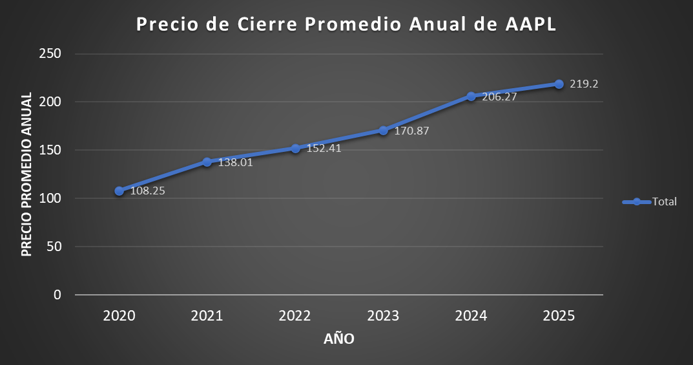
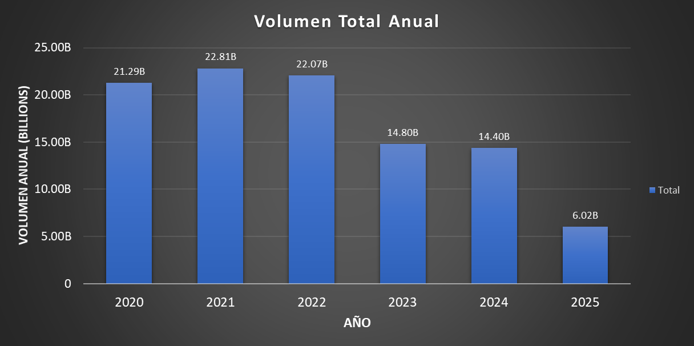
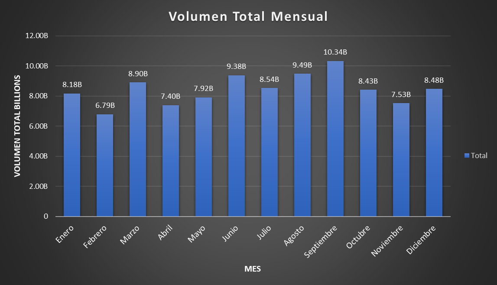
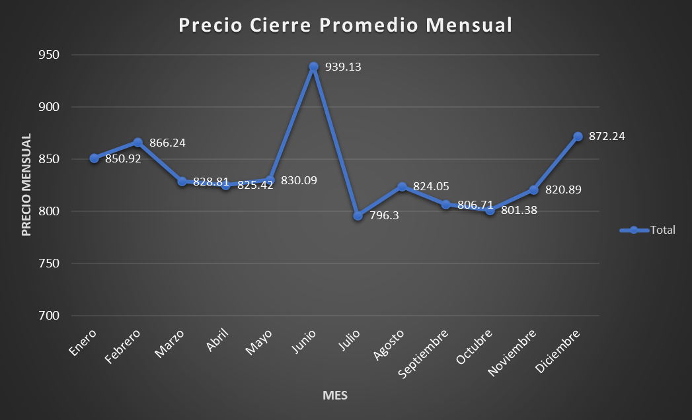
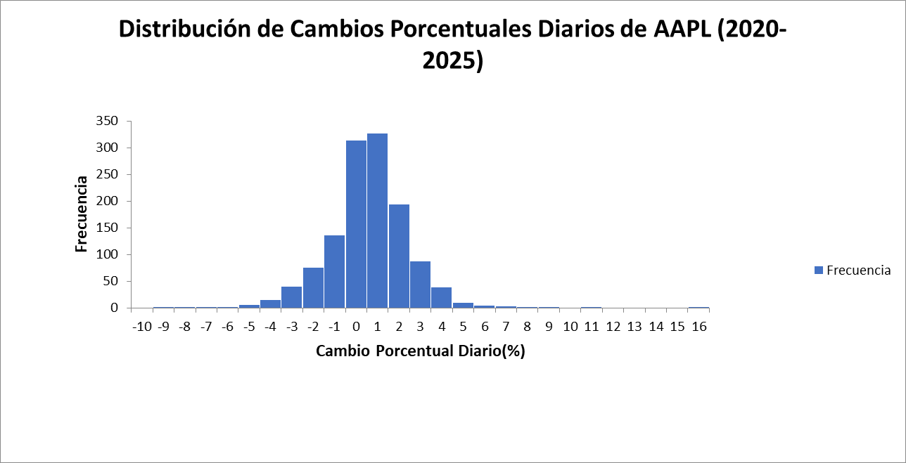

# Proyecto-Analisis-AAPL-2020-2025
Proyecto basado en SQL usando el dataset "apple_5yr_one.csv" tomando en Kaggle

## Análisis Anual del Rendimiento de Acciones de Apple (AAPL)

La primera parte del análisis se centra en evaluar el rendimiento de las acciones de Apple (AAPL) a nivel anual, observando el precio de cierre promedio, precios máximos y mínimos anuales, y el volumen total de operaciones. Esto nos da una macro visión de las tendencias de las acciones.

### Consulta SQL

```sql
SELECT
    EXTRACT(YEAR FROM fecha) AS "año",
    ROUND(AVG(precio_cierre), 2) AS precio_cierre_promedio_anual,
    ROUND(MAX(precio_cierre), 2) AS precio_cierre_maximo_anual,
    ROUND(MIN(precio_cierre), 2) AS precio_cierre_minimo_anual,
    ROUND(SUM(volumen), 2) AS volumen_total_anual
FROM
    aapl_daily_prices
GROUP BY
    "año"
ORDER BY
    "año";
```

### Resultados Obtenidos:

| año  | precio_cierre_promedio_anual | precio_cierre_maximo_anual | precio_cierre_minimo_anual | volumen_total_anual |
| :---: | :---: | :---: | :---: | :---: |
| 2020 | 108.25 | 133.34 | 78.33 | 212895973200.00 |
| 2021 | 138.01 | 177.00 | 113.68 | 228122068100.00 |
| 2022 | 152.41 | 178.65 | 124.43 | 220655045000.00 |
| 2023 | 170.87 | 196.67 | 123.42 | 148042572000.00 |
| 2024 | 206.27 | 258.40 | 164.01 | 143960681000.00 |
| 2025 | 219.20 | 246.78 | 172.19 | 6015363000.00 |

 
 

 

 ### Observación y Conclusiones Clave

* **Crecimiento Sostenido del Precio:** Podemos observar una clara tendencia a la alza en el precio del cierre promedio anual de Apple a lo largo de los años. Desde un promedio de $108.25 USD en el 2020 hasta $219.20 USD en 2025, lo cual demuestra un crecimiento significativo.
* **Aumento en Precios Maximos y Minimos:** Los precios maximos y minimos anuales tambien han seguido una trayectoria ascendente, lo cual sugiere que el valor general de la acción ha ido aumentando con el tiempo. Teniendo un pico maximo de $258.40 USD que se alcanzo en 2024
Volumen de Negociación Variable:
   * En los años **2020** y **2021** se registraron los volumenes de negociación más altos, lo que podría indicar un período de gran actividad en el mercado o un mayor interes y/o volatilidad en la acción.
   * A partir del **2023**, **2024**, y especialmente **2025**, el volumen total anual muestra una disminución notable. El volumen en 2025 es draasticamente mas bajo a los demas, esto se debe a que el dataset no cubre el año 2025 completo, ya que actualmente estamos en el mes de Junio del año 2025, por ello aun no se posee esta información.
* **Punto Alto en 2024:** El año 2024 se destaca como el año con el precio maximo absoluto en el rango de los datos ($258.40), y el promedio anual mas alto antes del 2025.


## Análisis Rendimiento Mes de Acciones de APPLE(AAPL)

### Consulta SQL

```sql
 SELECT
    EXTRACT(YEAR FROM fecha) AS año,
    EXTRACT(MONTH FROM fecha) AS mes,
    ROUND (AVG(precio_cierre), 2) AS precio_cierre_promedio_mensual,
    ROUND (MAX(precio_cierre), 2) AS precio_cierre_maximo_mensual,
    ROUND (MIN(precio_cierre), 2) AS precio_cierre_minimo_mensual,
    SUM(volumen) AS volumen_total_mensual
FROM
    aapl_daily_prices
GROUP BY
    año, mes
ORDER BY
    año, mes; 
```

### Resultados Obtenidos

| "año" | "mes" | "precio_cierre_promedio_mensual" | "precio_cierre_maximo_mensual" | "precio_cierre_minimo_mensual" | "volumen_total_mensual" |
|-------|-------|----------------------------------|--------------------------------|--------------------------------|-------------------------|
| 2020  | 6     | 84.90                            | 89.07                          | 78.33                          | 2970450400              |
| 2020  | 7     | 92.90                            | 103.29                         | 88.48                          | 3020283200              |
| 2020  | 8     | 114.19                           | 125.66                         | 105.89                         | 4070061100              |
| 2020  | 9     | 112.11                           | 130.67                         | 104.04                         | 3885245100              |
| 2020  | 10    | 113.37                           | 121.14                         | 106.01                         | 2894666500              |
| 2020  | 11    | 113.93                           | 117.35                         | 105.92                         | 2123077300              |
| 2020  | 12    | 124.17                           | 133.34                         | 118.80                         | 2322189600              |
| 2021  | 1     | 129.78                           | 139.65                         | 123.50                         | 2240262000              |
| 2021  | 2     | 128.46                           | 134.02                         | 118.20                         | 1833855600              |
| 2021  | 3     | 119.06                           | 124.85                         | 113.68                         | 2650418200              |
| 2021  | 4     | 128.78                           | 131.73                         | 120.17                         | 1889857500              |
| 2021  | 5     | 124.03                           | 129.49                         | 120.15                         | 1711934900              |
| 2021  | 6     | 127.18                           | 134.03                         | 120.90                         | 1606590000              |
| 2021  | 7     | 142.04                           | 145.96                         | 134.34                         | 1919035100              |
| 2021  | 8     | 145.19                           | 150.07                         | 142.41                         | 1461542800              |
| 2021  | 9     | 145.35                           | 153.57                         | 138.68                         | 1797835100              |
| 2021  | 10    | 142.67                           | 149.53                         | 136.37                         | 1565079200              |
| 2021  | 11    | 151.36                           | 162.24                         | 145.14                         | 1691029000              |
| 2021  | 12    | 170.34                           | 177.00                         | 158.85                         | 2444766700              |
| 2022  | 1     | 166.72                           | 178.65                         | 156.28                         | 2108446000              |
| 2022  | 2     | 166.87                           | 173.24                         | 157.31                         | 1627516300              |
| 2022  | 3     | 162.46                           | 175.88                         | 148.02                         | 2180800100              |
| 2022  | 4     | 163.95                           | 175.36                         | 153.87                         | 1687795600              |
| 2022  | 5     | 146.04                           | 163.16                         | 135.18                         | 2401040300              |
| 2022  | 6     | 137.59                           | 148.82                         | 128.01                         | 1749099800              |
| 2022  | 7     | 147.31                           | 159.94                         | 136.74                         | 1447125400              |
| 2022  | 8     | 164.44                           | 172.03                         | 154.95                         | 1510239600              |
| 2022  | 9     | 150.80                           | 161.07                         | 136.21                         | 2084722800              |
| 2022  | 10    | 142.92                           | 153.49                         | 136.34                         | 1868139700              |
| 2022  | 11    | 143.95                           | 149.36                         | 133.15                         | 1724847700              |
| 2022  | 12    | 136.11                           | 146.41                         | 124.43                         | 1675731200              |
| 2023  | 1     | 134.04                           | 144.06                         | 123.42                         | 1443652500              |
| 2023  | 2     | 149.18                           | 153.58                         | 143.57                         | 1307198900              |
| 2023  | 3     | 153.22                           | 163.04                         | 143.67                         | 1520266600              |
| 2023  | 4     | 163.18                           | 167.77                         | 158.29                         | 969709700               |
| 2023  | 5     | 170.82                           | 175.54                         | 163.92                         | 1275155500              |
| 2023  | 6     | 182.46                           | 192.05                         | 176.06                         | 1297101100              |
| 2023  | 7     | 190.50                           | 194.50                         | 186.22                         | 996066400               |
| 2023  | 8     | 179.45                           | 193.67                         | 172.51                         | 1322439400              |
| 2023  | 9     | 175.48                           | 188.07                         | 168.97                         | 1337586600              |
| 2023  | 10    | 173.17                           | 179.16                         | 165.46                         | 1172719600              |
| 2023  | 11    | 184.45                           | 190.06                         | 172.48                         | 1099586100              |
| 2023  | 12    | 192.90                           | 196.67                         | 188.05                         | 1062774800              |
| 2024  | 1     | 186.36                           | 193.76                         | 179.86                         | 1187219300              |
| 2024  | 2     | 183.59                           | 188.03                         | 179.66                         | 1161627000              |
| 2024  | 3     | 171.66                           | 178.58                         | 167.99                         | 1432782800              |
| 2024  | 4     | 168.59                           | 175.49                         | 164.01                         | 1245717000              |
| 2024  | 5     | 185.34                           | 191.45                         | 168.28                         | 1336537700              |
| 2024  | 6     | 205.30                           | 215.66                         | 192.22                         | 1723984500              |
| 2024  | 7     | 223.55                           | 233.73                         | 215.74                         | 1153099800              |
| 2024  | 8     | 220.78                           | 228.99                         | 206.27                         | 1122667000              |
| 2024  | 9     | 222.97                           | 232.18                         | 215.56                         | 1232140300              |
| 2024  | 10    | 229.25                           | 235.65                         | 220.91                         | 930736000               |
| 2024  | 11    | 227.20                           | 236.76                         | 221.23                         | 891640600               |
| 2024  | 12    | 248.72                           | 258.40                         | 239.01                         | 977916100               |
| 2025  | 1     | 234.02                           | 244.41                         | 222.10                         | 1200291700              |
| 2025  | 2     | 238.14                           | 246.78                         | 227.08                         | 862272300               |
| 2025  | 3     | 222.41                           | 238.76                         | 209.41                         | 1115239500              |
| 2025  | 4     | 200.92                           | 223.60                         | 172.19                         | 1606488200              |
| 2025  | 5     | 203.86                           | 213.04                         | 195.27                         | 1195728200              |
| 2025  | 6     | 201.70                           | 201.70                         | 201.70                         | 35343100                |







### Observación y Conclusiones Clave

**Tendencia de Crecimiento del Precio:** Los precios promedio del cierre siguen mostrando una tendencia sostenida al alza, con algunos meses de corrección natural
* **Picos Destacados:** El precio maximo mensual se alcanza con $258.40 USD en diciembre de 2024
* **Correcciones y consolidaciones:**Se observan ajustes en el precio después de periodos de crecimiento acelerado, especialmente desde Enero del 2025 con $234.02 USD hasta abril de 2025 donde hay una caida a $200.92 USD. Lo que puede indicar una fase de consolidación o correción despues de un año de fuertes ganancias.

**Volumen de transacciones** 
* El volumen de operaciones tiende a ser mas alto en periodos de incertidumbre o cambios bruscos en el precio. En abril de 2025, cuando el precio cayó significativamente, el volumen aumento a 1,606,488,200 lo cual sugiere una mayor actividad por parte de los inversores.
* En contraste en 2024 los meses como Octubre y Noviembre reflejan un volumen mas bajo, lo cual indica una menor actividad de compra y/o venta

**Maximos y Minimos** 
* El precio minimó se registra en Junio de 2020 con un valor de $78.33 USD, lo cual refleja el impacto de la incertidumbre global en el mercado bursatil que se vivio en ese periodo
* El precio de cierre maximo que se alcanzo es de $258.40 USD en el mes de Diciembre de 2024. Lo cual puede indicar una confianza de inversionistas en el futuro de Apple para el 2025


## Analisis Cambio porcentuales diarios

### Consulta SQL

```sql
SELECT
    fecha,
    precio_cierre,
    LAG(precio_cierre, 1) OVER (ORDER BY fecha) AS precio_cierre_anterior,
    (precio_cierre - LAG(precio_cierre, 1) OVER (ORDER BY fecha)) / LAG(precio_cierre, 1) OVER (ORDER BY fecha) * 100 AS cambio_porcentual_diario
FROM
    aapl_daily_prices
ORDER BY
    fecha;
```

### Resultados Obtenidos

| fecha      | precio_cierre | precio_cierre_anterior | cambio_porcentual_diario |
|------------|---------------|------------------------|--------------------------|
| 04/06/2020 | 78.33         | NULL                   | NULL                     |
| 05/06/2020 | 80.56         | 78.33                  | 2.84692966               |
| 08/06/2020 | 81.04         | 80.56                  | 0.5958292                |
| 09/06/2020 | 83.6          | 81.04                  | 3.15893386               |
| 10/06/2020 | 85.75         | 83.6                   | 2.57177033               |
| 11/06/2020 | 81.63         | 85.75                  | -4.80466472              |
| 12/06/2020 | 82.33         | 81.63                  | 0.85752787               |
| 15/06/2020 | 83.35         | 82.33                  | 1.23891656               |
| 16/06/2020 | 85.56         | 83.35                  | 2.65146971               |
| 17/06/2020 | 85.44         | 85.56                  | -0.14025245              |
| 18/06/2020 | 85.48         | 85.44                  | 0.04681648               |
| 19/06/2020 | 84.99         | 85.48                  | -0.5732335               |
| 22/06/2020 | 87.21         | 84.99                  | 2.61207201               |
| 23/06/2020 | 89.07         | 87.21                  | 2.13278294               |
| 24/06/2020 | 87.5          | 89.07                  | -1.76265858              |
| 25/06/2020 | 88.66         | 87.5                   | 1.32571429               |
| 26/06/2020 | 85.94         | 88.66                  | -3.06789984              |
| 29/06/2020 | 87.92         | 85.94                  | 2.30393298               |
| 30/06/2020 | 88.65         | 87.92                  | 0.83030027               |
| 01/07/2020 | 88.48         | 88.65                  | -0.19176537              |
| 02/07/2020 | 88.48         | 88.48                  | 0                        |
| 06/07/2020 | 90.85         | 88.48                  | 2.67857143               |
| 07/07/2020 | 90.57         | 90.85                  | -0.30820033              |
| 08/07/2020 | 92.68         | 90.57                  | 2.32968974               |
| 09/07/2020 | 93.08         | 92.68                  | 0.43159258               |
| 10/07/2020 | 93.24         | 93.08                  | 0.17189514               |
| 13/07/2020 | 92.81         | 93.24                  | -0.46117546              |
| 14/07/2020 | 94.35         | 92.81                  | 1.65930395               |
| 15/07/2020 | 95            | 94.35                  | 0.68892422               |
| 16/07/2020 | 93.83         | 95                     | -1.23157895              |
| 17/07/2020 | 93.64         | 93.83                  | -0.20249387              |
| 20/07/2020 | 95.61         | 93.64                  | 2.10380179               |
| 21/07/2020 | 94.29         | 95.61                  | -1.38060872              |
| 22/07/2020 | 94.56         | 94.29                  | 0.28635062               |
| 23/07/2020 | 90.25         | 94.56                  | -4.55795262              |
| 24/07/2020 | 90.03         | 90.25                  | -0.24376731              |
| 27/07/2020 | 92.16         | 90.03                  | 2.36587804               |
| 28/07/2020 | 90.65         | 92.16                  | -1.63845486              |
| 29/07/2020 | 92.39         | 90.65                  | 1.91947049               |
| 30/07/2020 | 93.5          | 92.39                  | 1.20142873               |
| 31/07/2020 | 103.29        | 93.5                   | 10.4705882               |
| 03/08/2020 | 105.89        | 103.29                 | 2.51718463               |
| 04/08/2020 | 106.6         | 105.89                 | 0.67050713               |
| 05/08/2020 | 106.99        | 106.6                  | 0.36585366               |
| 06/08/2020 | 110.72        | 106.99                 | 3.48630713               |
| 07/08/2020 | 108.2         | 110.72                 | -2.27601156              |
| 10/08/2020 | 109.78        | 108.2                  | 1.46025878               |
| 11/08/2020 | 106.51        | 109.78                 | -2.97868464              |
| 12/08/2020 | 110.05        | 106.51                 | 3.32363158               |
| 13/08/2020 | 112           | 110.05                 | 1.77192185               |
| 14/08/2020 | 111.9         | 112                    | -0.08928571              |
| 17/08/2020 | 111.61        | 111.9                  | -0.25915996              |
| 18/08/2020 | 112.54        | 111.61                 | 0.83325867               |
| 19/08/2020 | 112.68        | 112.54                 | 0.12440021               |
| 20/08/2020 | 115.18        | 112.68                 | 2.21867235               |
| 21/08/2020 | 121.11        | 115.18                 | 5.14846327               |
| 24/08/2020 | 122.56        | 121.11                 | 1.19725869               |
| 25/08/2020 | 121.56        | 122.56                 | -0.81592689              |
| 26/08/2020 | 123.21        | 121.56                 | 1.35735439               |
| 27/08/2020 | 121.74        | 123.21                 | -1.19308498              |
| 28/08/2020 | 121.54        | 121.74                 | -0.16428454              |
| 31/08/2020 | 125.66        | 121.54                 | 3.38983051               |
| 01/09/2020 | 130.67        | 125.66                 | 3.98694891               |
| 02/09/2020 | 127.96        | 130.67                 | -2.07392669              |
| 03/09/2020 | 117.72        | 127.96                 | -8.00250078              |
| 04/09/2020 | 117.79        | 117.72                 | 0.05946313               |
| 08/09/2020 | 109.87        | 117.79                 | -6.72383055              |
| 09/09/2020 | 114.25        | 109.87                 | 3.98652953               |
| 10/09/2020 | 110.52        | 114.25                 | -3.26477024              |
| 11/09/2020 | 109.07        | 110.52                 | -1.31197973              |
| 14/09/2020 | 112.34        | 109.07                 | 2.99807463               |
| 15/09/2020 | 112.52        | 112.34                 | 0.16022788               |
| 16/09/2020 | 109.19        | 112.52                 | -2.95947387              |
| 17/09/2020 | 107.45        | 109.19                 | -1.59355252              |
| 18/09/2020 | 104.04        | 107.45                 | -3.1735691               |
| 21/09/2020 | 107.2         | 104.04                 | 3.03729335               |
| 22/09/2020 | 108.88        | 107.2                  | 1.56716418               |
| 23/09/2020 | 104.32        | 108.88                 | -4.18809699              |
| 24/09/2020 | 105.39        | 104.32                 | 1.02569018               |
| 25/09/2020 | 109.34        | 105.39                 | 3.74798368               |
| 28/09/2020 | 111.95        | 109.34                 | 2.38704957               |
| 29/09/2020 | 111.1         | 111.95                 | -0.75926753              |
| 30/09/2020 | 112.78        | 111.1                  | 1.51215122               |
| 01/10/2020 | 113.73        | 112.78                 | 0.84234793               |
| 02/10/2020 | 110.06        | 113.73                 | -3.226941                |
| 05/10/2020 | 113.45        | 110.06                 | 3.08013811               |
| 06/10/2020 | 110.2         | 113.45                 | -2.8646981               |
| 07/10/2020 | 112.07        | 110.2                  | 1.6969147                |
| 08/10/2020 | 111.96        | 112.07                 | -0.09815294              |
| 09/10/2020 | 113.91        | 111.96                 | 1.74169346               |
| 12/10/2020 | 121.14        | 113.91                 | 6.34711614               |
| 13/10/2020 | 117.93        | 121.14                 | -2.64982665              |
| 14/10/2020 | 118.02        | 117.93                 | 0.07631646               |
| 15/10/2020 | 117.55        | 118.02                 | -0.39823759              |
| 16/10/2020 | 115.9         | 117.55                 | -1.40365802              |
| 19/10/2020 | 112.94        | 115.9                  | -2.5539258               |
| 20/10/2020 | 114.43        | 112.94                 | 1.31928458               |
| 21/10/2020 | 113.81        | 114.43                 | -0.54181596              |
| 22/10/2020 | 112.72        | 113.81                 | -0.95773658              |
| 23/10/2020 | 112.03        | 112.72                 | -0.61213627              |
| 26/10/2020 | 112.04        | 112.03                 | 0.00892618               |
| 27/10/2020 | 113.55        | 112.04                 | 1.34773295               |
| 28/10/2020 | 108.29        | 113.55                 | -4.63232056              |
| 29/10/2020 | 112.3         | 108.29                 | 3.70301967               |
| 30/10/2020 | 106.01        | 112.3                  | -5.60106857              |
| 02/11/2020 | 105.92        | 106.01                 | -0.08489765              |
| 03/11/2020 | 107.55        | 105.92                 | 1.53889728               |
| 04/11/2020 | 111.94        | 107.55                 | 4.08182241               |
| 05/11/2020 | 115.91        | 111.94                 | 3.54654279               |
| 06/11/2020 | 115.78        | 115.91                 | -0.11215598              |
| 09/11/2020 | 113.47        | 115.78                 | -1.99516324              |
| 10/11/2020 | 113.13        | 113.47                 | -0.29963867              |
| 11/11/2020 | 116.56        | 113.13                 | 3.03191019               |
| 12/11/2020 | 116.29        | 116.56                 | -0.23164036              |
| 13/11/2020 | 116.34        | 116.29                 | 0.04299596               |
| 16/11/2020 | 117.35        | 116.34                 | 0.86814509               |
| 17/11/2020 | 116.47        | 117.35                 | -0.74989348              |
| 18/11/2020 | 115.14        | 116.47                 | -1.14192496              |
| 19/11/2020 | 115.73        | 115.14                 | 0.51241966               |
| 20/11/2020 | 114.47        | 115.73                 | -1.08874104              |
| 23/11/2020 | 111.06        | 114.47                 | -2.97894645              |
| 24/11/2020 | 112.35        | 111.06                 | 1.16153431               |
| 25/11/2020 | 113.19        | 112.35                 | 0.74766355               |
| 27/11/2020 | 113.73        | 113.19                 | 0.47707395               |
| 30/11/2020 | 116.13        | 113.73                 | 2.11026114               |
| 01/12/2020 | 119.71        | 116.13                 | 3.08275209               |
| 02/12/2020 | 120.06        | 119.71                 | 0.29237324               |
| 03/12/2020 | 119.93        | 120.06                 | -0.10827919              |
| 04/12/2020 | 119.26        | 119.93                 | -0.55865922              |
| 07/12/2020 | 120.72        | 119.26                 | 1.224216                 |
| 08/12/2020 | 121.33        | 120.72                 | 0.50530152               |
| 09/12/2020 | 118.8         | 121.33                 | -2.08522212              |
| 10/12/2020 | 120.22        | 118.8                  | 1.1952862                |
| 11/12/2020 | 119.41        | 120.22                 | -0.67376476              |
| 14/12/2020 | 118.8         | 119.41                 | -0.51084499              |
| 15/12/2020 | 124.75        | 118.8                  | 5.00841751               |
| 16/12/2020 | 124.68        | 124.75                 | -0.05611222              |
| 17/12/2020 | 125.55        | 124.68                 | 0.69778633               |
| 18/12/2020 | 123.56        | 125.55                 | -1.58502589              |
| 21/12/2020 | 125.09        | 123.56                 | 1.23826481               |
| 22/12/2020 | 128.65        | 125.09                 | 2.84595092               |
| 23/12/2020 | 127.75        | 128.65                 | -0.69957248              |
| 24/12/2020 | 128.74        | 127.75                 | 0.77495108               |
| 28/12/2020 | 133.34        | 128.74                 | 3.57309306               |
| 29/12/2020 | 131.57        | 133.34                 | -1.32743363              |
| 30/12/2020 | 130.44        | 131.57                 | -0.8588584               |
| 31/12/2020 | 129.44        | 130.44                 | -0.766636                |
| 04/01/2021 | 126.24        | 129.44                 | -2.47218789              |
| 05/01/2021 | 127.8         | 126.24                 | 1.23574144               |
| 06/01/2021 | 123.5         | 127.8                  | -3.36463224              |
| 07/01/2021 | 127.71        | 123.5                  | 3.40890688               |
| 08/01/2021 | 128.82        | 127.71                 | 0.86915668               |
| 11/01/2021 | 125.82        | 128.82                 | -2.32883093              |
| 12/01/2021 | 125.64        | 125.82                 | -0.14306152              |
| 13/01/2021 | 127.68        | 125.64                 | 1.62368672               |
| 14/01/2021 | 125.75        | 127.68                 | -1.51159148              |
| 15/01/2021 | 124.03        | 125.75                 | -1.36779324              |
| 19/01/2021 | 124.7         | 124.03                 | 0.54019189               |
| 20/01/2021 | 128.8         | 124.7                  | 3.28789094               |
| 21/01/2021 | 133.52        | 128.8                  | 3.66459627               |
| 22/01/2021 | 135.66        | 133.52                 | 1.60275614               |
| 25/01/2021 | 139.42        | 135.66                 | 2.77163497               |
| 26/01/2021 | 139.65        | 139.42                 | 0.16496916               |
| 27/01/2021 | 138.58        | 139.65                 | -0.76620122              |
| 28/01/2021 | 133.73        | 138.58                 | -3.49978352              |
| 29/01/2021 | 128.73        | 133.73                 | -3.73887684              |
| 01/02/2021 | 130.85        | 128.73                 | 1.64685776               |
| 02/02/2021 | 131.68        | 130.85                 | 0.6343141                |
| 03/02/2021 | 130.66        | 131.68                 | -0.7746051               |
| 04/02/2021 | 134.02        | 130.66                 | 2.57155977               |
| 05/02/2021 | 133.61        | 134.02                 | -0.30592449              |
| 08/02/2021 | 133.76        | 133.61                 | 0.11226705               |
| 09/02/2021 | 132.88        | 133.76                 | -0.65789474              |
| 10/02/2021 | 132.27        | 132.88                 | -0.45906081              |
| 11/02/2021 | 132.02        | 132.27                 | -0.18900733              |
| 12/02/2021 | 132.25        | 132.02                 | 0.17421603               |
| 16/02/2021 | 130.12        | 132.25                 | -1.61058601              |
| 17/02/2021 | 127.83        | 130.12                 | -1.75991393              |
| 18/02/2021 | 126.72        | 127.83                 | -0.86834077              |
| 19/02/2021 | 126.88        | 126.72                 | 0.12626263               |
| 22/02/2021 | 123.1         | 126.88                 | -2.97919294              |
| 23/02/2021 | 122.96        | 123.1                  | -0.11372868              |
| 24/02/2021 | 122.46        | 122.96                 | -0.4066363               |
| 25/02/2021 | 118.2         | 122.46                 | -3.47868692              |
| 26/02/2021 | 118.47        | 118.2                  | 0.2284264                |
| 01/03/2021 | 124.85        | 118.47                 | 5.38532962               |
| 02/03/2021 | 122.24        | 124.85                 | -2.09050861              |
| 03/03/2021 | 119.25        | 122.24                 | -2.44600785              |
| 04/03/2021 | 117.36        | 119.25                 | -1.58490566              |
| 05/03/2021 | 118.62        | 117.36                 | 1.07361963               |
| 08/03/2021 | 113.68        | 118.62                 | -4.1645591               |
| 09/03/2021 | 118.3         | 113.68                 | 4.06403941               |
| 10/03/2021 | 117.22        | 118.3                  | -0.91293322              |
| 11/03/2021 | 119.15        | 117.22                 | 1.64647671               |
| 12/03/2021 | 118.24        | 119.15                 | -0.76374318              |
| 15/03/2021 | 121.13        | 118.24                 | 2.44418133               |
| 16/03/2021 | 122.68        | 121.13                 | 1.27961694               |
| 17/03/2021 | 121.89        | 122.68                 | -0.64395174              |
| 18/03/2021 | 117.75        | 121.89                 | -3.39650505              |
| 19/03/2021 | 117.23        | 117.75                 | -0.44161359              |
| 22/03/2021 | 120.55        | 117.23                 | 2.83203958               |
| 23/03/2021 | 119.72        | 120.55                 | -0.68851099              |
| 24/03/2021 | 117.32        | 119.72                 | -2.00467758              |
| 25/03/2021 | 117.81        | 117.32                 | 0.4176611                |
| 26/03/2021 | 118.42        | 117.81                 | 0.51778287               |
| 29/03/2021 | 118.59        | 118.42                 | 0.14355683               |
| 30/03/2021 | 117.14        | 118.59                 | -1.22270006              |
| 31/03/2021 | 119.34        | 117.14                 | 1.87809459               |
| 01/04/2021 | 120.17        | 119.34                 | 0.69549187               |
| 05/04/2021 | 123           | 120.17                 | 2.35499709               |
| 06/04/2021 | 123.3         | 123                    | 0.24390244               |
| 07/04/2021 | 124.95        | 123.3                  | 1.33819951               |
| 08/04/2021 | 127.36        | 124.95                 | 1.92877151               |
| 09/04/2021 | 129.94        | 127.36                 | 2.02575377               |
| 12/04/2021 | 128.22        | 129.94                 | -1.32368786              |
| 13/04/2021 | 131.33        | 128.22                 | 2.42551864               |
| 14/04/2021 | 128.99        | 131.33                 | -1.78177111              |
| 15/04/2021 | 131.4         | 128.99                 | 1.86836189               |
| 16/04/2021 | 131.07        | 131.4                  | -0.25114155              |
| 19/04/2021 | 131.73        | 131.07                 | 0.50354772               |
| 20/04/2021 | 130.04        | 131.73                 | -1.2829272               |
| 21/04/2021 | 130.42        | 130.04                 | 0.29221778               |
| 22/04/2021 | 128.9         | 130.42                 | -1.16546542              |
| 23/04/2021 | 131.23        | 128.9                  | 1.80760279               |
| 26/04/2021 | 131.62        | 131.23                 | 0.29718814               |
| 27/04/2021 | 131.29        | 131.62                 | -0.25072177              |
| 28/04/2021 | 130.5         | 131.29                 | -0.60172138              |
| 29/04/2021 | 130.4         | 130.5                  | -0.07662835              |
| 30/04/2021 | 128.43        | 130.4                  | -1.5107362               |
| 03/05/2021 | 129.49        | 128.43                 | 0.82535233               |
| 04/05/2021 | 124.9         | 129.49                 | -3.54467526              |
| 05/05/2021 | 125.15        | 124.9                  | 0.20016013               |
| 06/05/2021 | 126.75        | 125.15                 | 1.27846584               |
| 07/05/2021 | 127.43        | 126.75                 | 0.53648915               |
| 10/05/2021 | 124.14        | 127.43                 | -2.58180962              |
| 11/05/2021 | 123.22        | 124.14                 | -0.74109876              |
| 12/05/2021 | 120.15        | 123.22                 | -2.49147866              |
| 13/05/2021 | 122.3         | 120.15                 | 1.78942988               |
| 14/05/2021 | 124.72        | 122.3                  | 1.9787408                |
| 17/05/2021 | 123.57        | 124.72                 | -0.92206543              |
| 18/05/2021 | 122.18        | 123.57                 | -1.1248685               |
| 19/05/2021 | 122.02        | 122.18                 | -0.13095433              |
| 20/05/2021 | 124.59        | 122.02                 | 2.1062121                |
| 21/05/2021 | 122.75        | 124.59                 | -1.47684405              |
| 24/05/2021 | 124.38        | 122.75                 | 1.32790224               |
| 25/05/2021 | 124.19        | 124.38                 | -0.15275768              |
| 26/05/2021 | 124.14        | 124.19                 | -0.04026089              |
| 27/05/2021 | 122.6         | 124.14                 | -1.24053488              |
| 28/05/2021 | 121.95        | 122.6                  | -0.53017945              |
| 01/06/2021 | 121.62        | 121.95                 | -0.27060271              |
| 02/06/2021 | 122.39        | 121.62                 | 0.63311955               |
| 03/06/2021 | 120.9         | 122.39                 | -1.21741972              |
| 04/06/2021 | 123.2         | 120.9                  | 1.90239868               |
| 07/06/2021 | 123.21        | 123.2                  | 0.00811688               |
| 08/06/2021 | 124.03        | 123.21                 | 0.6655304                |
| 09/06/2021 | 124.41        | 124.03                 | 0.30637749               |
| 10/06/2021 | 123.41        | 124.41                 | -0.80379391              |
| 11/06/2021 | 124.63        | 123.41                 | 0.98857467               |
| 14/06/2021 | 127.69        | 124.63                 | 2.45526759               |
| 15/06/2021 | 126.87        | 127.69                 | -0.64218028              |
| 16/06/2021 | 127.37        | 126.87                 | 0.3941042                |
| 17/06/2021 | 128.97        | 127.37                 | 1.25618277               |
| 18/06/2021 | 127.67        | 128.97                 | -1.00798635              |
| 21/06/2021 | 129.47        | 127.67                 | 1.40988486               |
| 22/06/2021 | 131.12        | 129.47                 | 1.27442651               |
| 23/06/2021 | 130.84        | 131.12                 | -0.21354484              |
| 24/06/2021 | 130.56        | 130.84                 | -0.21400183              |
| 25/06/2021 | 130.26        | 130.56                 | -0.22977941              |
| 28/06/2021 | 131.9         | 130.26                 | 1.25902042               |
| 29/06/2021 | 133.42        | 131.9                  | 1.15238817               |
| 30/06/2021 | 134.03        | 133.42                 | 0.45720282               |
| 01/07/2021 | 134.34        | 134.03                 | 0.2312915                |
| 02/07/2021 | 136.97        | 134.34                 | 1.95771922               |
| 06/07/2021 | 138.98        | 136.97                 | 1.46747463               |
| 07/07/2021 | 141.48        | 138.98                 | 1.79881997               |
| 08/07/2021 | 140.18        | 141.48                 | -0.91885779              |
| 09/07/2021 | 142.01        | 140.18                 | 1.3054644                |
| 12/07/2021 | 141.41        | 142.01                 | -0.42250546              |
| 13/07/2021 | 142.53        | 141.41                 | 0.79202319               |
| 14/07/2021 | 145.96        | 142.53                 | 2.40651091               |
| 15/07/2021 | 145.31        | 145.96                 | -0.44532749              |
| 16/07/2021 | 143.26        | 145.31                 | -1.41077696              |
| 19/07/2021 | 139.4         | 143.26                 | -2.69440179              |
| 20/07/2021 | 143.03        | 139.4                  | 2.60401722               |
| 21/07/2021 | 142.29        | 143.03                 | -0.51737398              |
| 22/07/2021 | 143.66        | 142.29                 | 0.9628224                |
| 23/07/2021 | 145.38        | 143.66                 | 1.19727134               |
| 26/07/2021 | 145.8         | 145.38                 | 0.28889806               |
| 27/07/2021 | 143.63        | 145.8                  | -1.48834019              |
| 28/07/2021 | 141.88        | 143.63                 | -1.21840841              |
| 29/07/2021 | 142.53        | 141.88                 | 0.45813363               |
| 30/07/2021 | 142.74        | 142.53                 | 0.1473374                |
| 02/08/2021 | 142.41        | 142.74                 | -0.23118958              |
| 03/08/2021 | 144.21        | 142.41                 | 1.26395618               |
| 04/08/2021 | 143.81        | 144.21                 | -0.27737328              |
| 05/08/2021 | 143.92        | 143.81                 | 0.07648981               |
| 06/08/2021 | 143.23        | 143.92                 | -0.47943302              |
| 09/08/2021 | 143.18        | 143.23                 | -0.03490889              |
| 10/08/2021 | 142.7         | 143.18                 | -0.33524235              |
| 11/08/2021 | 142.96        | 142.7                  | 0.18220042               |
| 12/08/2021 | 145.92        | 142.96                 | 2.07050923               |
| 13/08/2021 | 146.13        | 145.92                 | 0.14391447               |
| 16/08/2021 | 148.11        | 146.13                 | 1.35495791               |
| 17/08/2021 | 147.2         | 148.11                 | -0.61440821              |
| 18/08/2021 | 143.45        | 147.2                  | -2.54755435              |
| 19/08/2021 | 143.78        | 143.45                 | 0.23004531               |
| 20/08/2021 | 145.24        | 143.78                 | 1.01544026               |
| 23/08/2021 | 146.73        | 145.24                 | 1.02588819               |
| 24/08/2021 | 146.64        | 146.73                 | -0.06133715              |
| 25/08/2021 | 145.41        | 146.64                 | -0.83878887              |
| 26/08/2021 | 144.6         | 145.41                 | -0.5570456               |
| 27/08/2021 | 145.64        | 144.6                  | 0.71922545               |
| 30/08/2021 | 150.07        | 145.64                 | 3.04174677               |
| 31/08/2021 | 148.81        | 150.07                 | -0.83960818              |
| 01/09/2021 | 149.47        | 148.81                 | 0.44351858               |
| 02/09/2021 | 150.59        | 149.47                 | 0.74931424               |
| 03/09/2021 | 151.23        | 150.59                 | 0.42499502               |
| 07/09/2021 | 153.57        | 151.23                 | 1.54731204               |
| 08/09/2021 | 152.02        | 153.57                 | -1.00931171              |
| 09/09/2021 | 151           | 152.02                 | -0.67096435              |
| 10/09/2021 | 146           | 151                    | -3.31125828              |
| 13/09/2021 | 146.57        | 146                    | 0.39041096               |
| 14/09/2021 | 145.17        | 146.57                 | -0.955175                |
| 15/09/2021 | 146.06        | 145.17                 | 0.61307433               |
| 16/09/2021 | 145.83        | 146.06                 | -0.15746953              |
| 17/09/2021 | 143.15        | 145.83                 | -1.83775629              |
| 20/09/2021 | 140.09        | 143.15                 | -2.13761788              |
| 21/09/2021 | 140.57        | 140.09                 | 0.34263688               |
| 22/09/2021 | 142.95        | 140.57                 | 1.69310664               |
| 23/09/2021 | 143.91        | 142.95                 | 0.67156348               |
| 24/09/2021 | 143.99        | 143.91                 | 0.0555903                |
| 27/09/2021 | 142.48        | 143.99                 | -1.04868394              |
| 28/09/2021 | 139.08        | 142.48                 | -2.38629983              |
| 29/09/2021 | 139.99        | 139.08                 | 0.65429968               |
| 30/09/2021 | 138.68        | 139.99                 | -0.93578113              |
| 01/10/2021 | 139.81        | 138.68                 | 0.8148255                |
| 04/10/2021 | 136.37        | 139.81                 | -2.46048208              |
| 05/10/2021 | 138.3         | 136.37                 | 1.41526729               |
| 06/10/2021 | 139.17        | 138.3                  | 0.62906725               |
| 07/10/2021 | 140.44        | 139.17                 | 0.91255299               |
| 08/10/2021 | 140.05        | 140.44                 | -0.27769866              |
| 11/10/2021 | 139.97        | 140.05                 | -0.05712246              |
| 12/10/2021 | 138.69        | 139.97                 | -0.91448167              |
| 13/10/2021 | 138.1         | 138.69                 | -0.42540919              |
| 14/10/2021 | 140.9         | 138.1                  | 2.02751629               |
| 15/10/2021 | 141.96        | 140.9                  | 0.7523066                |
| 18/10/2021 | 143.63        | 141.96                 | 1.17638771               |
| 19/10/2021 | 145.8         | 143.63                 | 1.51082643               |
| 20/10/2021 | 146.29        | 145.8                  | 0.33607682               |
| 21/10/2021 | 146.5         | 146.29                 | 0.14355048               |
| 22/10/2021 | 145.73        | 146.5                  | -0.52559727              |
| 25/10/2021 | 145.68        | 145.73                 | -0.03431003              |
| 26/10/2021 | 146.35        | 145.68                 | 0.45991214               |
| 27/10/2021 | 145.89        | 146.35                 | -0.314315                |
| 28/10/2021 | 149.53        | 145.89                 | 2.4950305                |
| 29/10/2021 | 146.82        | 149.53                 | -1.81234535              |
| 01/11/2021 | 145.99        | 146.82                 | -0.56531808              |
| 02/11/2021 | 147.03        | 145.99                 | 0.71237756               |
| 03/11/2021 | 148.47        | 147.03                 | 0.97939196               |
| 04/11/2021 | 147.95        | 148.47                 | -0.35023911              |
| 05/11/2021 | 148.48        | 147.95                 | 0.35822913               |
| 08/11/2021 | 147.66        | 148.48                 | -0.55226293              |
| 09/11/2021 | 148.02        | 147.66                 | 0.24380333               |
| 10/11/2021 | 145.19        | 148.02                 | -1.9119038               |
| 11/11/2021 | 145.14        | 145.19                 | -0.03443763              |
| 12/11/2021 | 147.22        | 145.14                 | 1.43309908               |
| 15/11/2021 | 147.23        | 147.22                 | 0.00679256               |
| 16/11/2021 | 148.21        | 147.23                 | 0.66562521               |
| 17/11/2021 | 150.65        | 148.21                 | 1.64631266               |
| 18/11/2021 | 154.95        | 150.65                 | 2.85429804               |
| 19/11/2021 | 157.58        | 154.95                 | 1.69732172               |
| 22/11/2021 | 158.04        | 157.58                 | 0.29191522               |
| 23/11/2021 | 158.43        | 158.04                 | 0.24677297               |
| 24/11/2021 | 158.95        | 158.43                 | 0.32822067               |
| 26/11/2021 | 153.91        | 158.95                 | -3.17080843              |
| 29/11/2021 | 157.28        | 153.91                 | 2.18959132               |
| 30/11/2021 | 162.24        | 157.28                 | 3.15361139               |
| 01/12/2021 | 161.72        | 162.24                 | -0.32051282              |
| 02/12/2021 | 160.73        | 161.72                 | -0.61216918              |
| 03/12/2021 | 158.85        | 160.73                 | -1.16966341              |
| 06/12/2021 | 162.26        | 158.85                 | 2.14667926               |
| 07/12/2021 | 168.02        | 162.26                 | 3.54985825               |
| 08/12/2021 | 171.84        | 168.02                 | 2.27353886               |
| 09/12/2021 | 171.33        | 171.84                 | -0.29678771              |
| 10/12/2021 | 176.13        | 171.33                 | 2.80161093               |
| 13/12/2021 | 172.49        | 176.13                 | -2.06665531              |
| 14/12/2021 | 171.11        | 172.49                 | -0.80004638              |
| 15/12/2021 | 175.99        | 171.11                 | 2.85196657               |
| 16/12/2021 | 169.08        | 175.99                 | -3.92635945              |
| 17/12/2021 | 167.98        | 169.08                 | -0.65057961              |
| 20/12/2021 | 166.61        | 167.98                 | -0.81557328              |
| 21/12/2021 | 169.79        | 166.61                 | 1.90864894               |
| 22/12/2021 | 172.39        | 169.79                 | 1.53130337               |
| 23/12/2021 | 173.02        | 172.39                 | 0.36545043               |
| 27/12/2021 | 177           | 173.02                 | 2.3003121                |
| 28/12/2021 | 175.98        | 177                    | -0.57627119              |
| 29/12/2021 | 176.06        | 175.98                 | 0.04545971               |
| 30/12/2021 | 174.91        | 176.06                 | -0.65318641              |
| 31/12/2021 | 174.29        | 174.91                 | -0.35446801              |
| 03/01/2022 | 178.65        | 174.29                 | 2.50157783               |
| 04/01/2022 | 176.38        | 178.65                 | -1.27064092              |
| 05/01/2022 | 171.69        | 176.38                 | -2.65903164              |
| 06/01/2022 | 168.82        | 171.69                 | -1.67161745              |
| 07/01/2022 | 168.99        | 168.82                 | 0.10069897               |
| 10/01/2022 | 169.01        | 168.99                 | 0.01183502               |
| 11/01/2022 | 171.84        | 169.01                 | 1.67445713               |
| 12/01/2022 | 172.29        | 171.84                 | 0.26187151               |
| 13/01/2022 | 169.01        | 172.29                 | -1.9037669               |
| 14/01/2022 | 169.87        | 169.01                 | 0.50884563               |
| 18/01/2022 | 166.66        | 169.87                 | -1.88968034              |
| 19/01/2022 | 163.16        | 166.66                 | -2.100084                |
| 20/01/2022 | 161.47        | 163.16                 | -1.03579309              |
| 21/01/2022 | 159.41        | 161.47                 | -1.27577878              |
| 24/01/2022 | 158.63        | 159.41                 | -0.48930431              |
| 25/01/2022 | 156.83        | 158.63                 | -1.13471601              |
| 26/01/2022 | 156.74        | 156.83                 | -0.05738698              |
| 27/01/2022 | 156.28        | 156.74                 | -0.29347965              |
| 28/01/2022 | 167.18        | 156.28                 | 6.97466087               |
| 31/01/2022 | 171.55        | 167.18                 | 2.61394904               |
| 01/02/2022 | 171.38        | 171.55                 | -0.09909647              |
| 02/02/2022 | 172.59        | 171.38                 | 0.70603338               |
| 03/02/2022 | 169.7         | 172.59                 | -1.67448867              |
| 04/02/2022 | 169.42        | 169.7                  | -0.16499705              |
| 07/02/2022 | 168.7         | 169.42                 | -0.42497934              |
| 08/02/2022 | 171.82        | 168.7                  | 1.84943687               |
| 09/02/2022 | 173.24        | 171.82                 | 0.82644628               |
| 10/02/2022 | 169.15        | 173.24                 | -2.36088663              |
| 11/02/2022 | 165.73        | 169.15                 | -2.02187408              |
| 14/02/2022 | 165.97        | 165.73                 | 0.14481385               |
| 15/02/2022 | 169.81        | 165.97                 | 2.31367115               |
| 16/02/2022 | 169.58        | 169.81                 | -0.1354455               |
| 17/02/2022 | 165.97        | 169.58                 | -2.12878877              |
| 18/02/2022 | 164.42        | 165.97                 | -0.93390372              |
| 22/02/2022 | 161.49        | 164.42                 | -1.78202165              |
| 23/02/2022 | 157.31        | 161.49                 | -2.58839557              |
| 24/02/2022 | 159.94        | 157.31                 | 1.67185811               |
| 25/02/2022 | 162.01        | 159.94                 | 1.29423534               |
| 28/02/2022 | 162.27        | 162.01                 | 0.16048392               |
| 01/03/2022 | 160.39        | 162.27                 | -1.15856289              |
| 02/03/2022 | 163.69        | 160.39                 | 2.05748488               |
| 03/03/2022 | 163.37        | 163.69                 | -0.19549148              |
| 04/03/2022 | 160.36        | 163.37                 | -1.84244353              |
| 07/03/2022 | 156.55        | 160.36                 | -2.37590422              |
| 08/03/2022 | 154.73        | 156.55                 | -1.16256787              |
| 09/03/2022 | 160.14        | 154.73                 | 3.49641311               |
| 10/03/2022 | 155.79        | 160.14                 | -2.71637317              |
| 11/03/2022 | 152.06        | 155.79                 | -2.39424867              |
| 14/03/2022 | 148.02        | 152.06                 | -2.65684598              |
| 15/03/2022 | 152.42        | 148.02                 | 2.97257127               |
| 16/03/2022 | 156.84        | 152.42                 | 2.89988191               |
| 17/03/2022 | 157.85        | 156.84                 | 0.64396838               |
| 18/03/2022 | 161.15        | 157.85                 | 2.09059233               |
| 21/03/2022 | 162.53        | 161.15                 | 0.85634502               |
| 22/03/2022 | 165.91        | 162.53                 | 2.07961607               |
| 23/03/2022 | 167.28        | 165.91                 | 0.8257489                |
| 24/03/2022 | 171.07        | 167.28                 | 2.26566236               |
| 25/03/2022 | 171.71        | 171.07                 | 0.37411586               |
| 28/03/2022 | 172.57        | 171.71                 | 0.50084445               |
| 29/03/2022 | 175.88        | 172.57                 | 1.91806224               |
| 30/03/2022 | 174.71        | 175.88                 | -0.66522629              |
| 31/03/2022 | 171.6         | 174.71                 | -1.78009273              |
| 01/04/2022 | 171.31        | 171.6                  | -0.16899767              |
| 04/04/2022 | 175.36        | 171.31                 | 2.36413519               |
| 05/04/2022 | 172.04        | 175.36                 | -1.89324818              |
| 06/04/2022 | 168.87        | 172.04                 | -1.84259475              |
| 07/04/2022 | 169.17        | 168.87                 | 0.17765145               |
| 08/04/2022 | 167.16        | 169.17                 | -1.18815393              |
| 11/04/2022 | 162.89        | 167.16                 | -2.55443886              |
| 12/04/2022 | 164.77        | 162.89                 | 1.15415311               |
| 13/04/2022 | 167.46        | 164.77                 | 1.63257875               |
| 14/04/2022 | 162.44        | 167.46                 | -2.9977308               |
| 18/04/2022 | 162.23        | 162.44                 | -0.1292785               |
| 19/04/2022 | 164.52        | 162.23                 | 1.41157616               |
| 20/04/2022 | 164.35        | 164.52                 | -0.1033309               |
| 21/04/2022 | 163.55        | 164.35                 | -0.48676605              |
| 22/04/2022 | 159           | 163.55                 | -2.78202385              |
| 25/04/2022 | 160.07        | 159                    | 0.67295597               |
| 26/04/2022 | 154.1         | 160.07                 | -3.72961829              |
| 27/04/2022 | 153.87        | 154.1                  | -0.14925373              |
| 28/04/2022 | 160.82        | 153.87                 | 4.5167999                |
| 29/04/2022 | 154.93        | 160.82                 | -3.66247979              |
| 02/05/2022 | 155.24        | 154.93                 | 0.20009036               |
| 03/05/2022 | 156.73        | 155.24                 | 0.95980417               |
| 04/05/2022 | 163.16        | 156.73                 | 4.10259682               |
| 05/05/2022 | 154.07        | 163.16                 | -5.57121844              |
| 06/05/2022 | 154.8         | 154.07                 | 0.47381061               |
| 09/05/2022 | 149.66        | 154.8                  | -3.32041344              |
| 10/05/2022 | 152.07        | 149.66                 | 1.61031672               |
| 11/05/2022 | 144.19        | 152.07                 | -5.18182416              |
| 12/05/2022 | 140.31        | 144.19                 | -2.69089396              |
| 13/05/2022 | 144.79        | 140.31                 | 3.19292994               |
| 16/05/2022 | 143.24        | 144.79                 | -1.07051592              |
| 17/05/2022 | 146.88        | 143.24                 | 2.54118961               |
| 18/05/2022 | 138.6         | 146.88                 | -5.6372549               |
| 19/05/2022 | 135.18        | 138.6                  | -2.46753247              |
| 20/05/2022 | 135.42        | 135.18                 | 0.17754106               |
| 23/05/2022 | 140.85        | 135.42                 | 4.00974745               |
| 24/05/2022 | 138.14        | 140.85                 | -1.92403266              |
| 25/05/2022 | 138.3         | 138.14                 | 0.11582453               |
| 26/05/2022 | 141.51        | 138.3                  | 2.32104121               |
| 27/05/2022 | 147.28        | 141.51                 | 4.07745036               |
| 31/05/2022 | 146.49        | 147.28                 | -0.53639326              |
| 01/06/2022 | 146.36        | 146.49                 | -0.08874326              |
| 02/06/2022 | 148.82        | 146.36                 | 1.6807871                |
| 03/06/2022 | 143.08        | 148.82                 | -3.85700847              |
| 06/06/2022 | 143.83        | 143.08                 | 0.52418228               |
| 07/06/2022 | 146.36        | 143.83                 | 1.75902107               |
| 08/06/2022 | 145.62        | 146.36                 | -0.50560262              |
| 09/06/2022 | 140.39        | 145.62                 | -3.59153962              |
| 10/06/2022 | 134.96        | 140.39                 | -3.86779685              |
| 13/06/2022 | 129.8         | 134.96                 | -3.82335507              |
| 14/06/2022 | 130.66        | 129.8                  | 0.66255778               |
| 15/06/2022 | 133.29        | 130.66                 | 2.0128578                |
| 16/06/2022 | 128.01        | 133.29                 | -3.96128742              |
| 17/06/2022 | 129.48        | 128.01                 | 1.14834779               |
| 21/06/2022 | 133.72        | 129.48                 | 3.27463701               |
| 22/06/2022 | 133.21        | 133.72                 | -0.38139396              |
| 23/06/2022 | 136.09        | 133.21                 | 2.16199985               |
| 24/06/2022 | 139.42        | 136.09                 | 2.44691013               |
| 27/06/2022 | 139.42        | 139.42                 | 0                        |
| 28/06/2022 | 135.27        | 139.42                 | -2.97661742              |
| 29/06/2022 | 137.03        | 135.27                 | 1.3011015                |
| 30/06/2022 | 134.56        | 137.03                 | -1.80252499              |
| 01/07/2022 | 136.74        | 134.56                 | 1.62009512               |
| 05/07/2022 | 139.32        | 136.74                 | 1.88679245               |
| 06/07/2022 | 140.66        | 139.32                 | 0.96181453               |
| 07/07/2022 | 144.04        | 140.66                 | 2.40295749               |
| 08/07/2022 | 144.72        | 144.04                 | 0.47209109               |
| 11/07/2022 | 142.58        | 144.72                 | -1.47871752              |
| 12/07/2022 | 143.56        | 142.58                 | 0.68733343               |
| 13/07/2022 | 143.19        | 143.56                 | -0.25773196              |
| 14/07/2022 | 146.13        | 143.19                 | 2.05321601               |
| 15/07/2022 | 147.8         | 146.13                 | 1.14281804               |
| 18/07/2022 | 144.75        | 147.8                  | -2.06359946              |
| 19/07/2022 | 148.62        | 144.75                 | 2.67357513               |
| 20/07/2022 | 150.62        | 148.62                 | 1.3457139                |
| 21/07/2022 | 152.9         | 150.62                 | 1.51374319               |
| 22/07/2022 | 151.66        | 152.9                  | -0.81098757              |
| 25/07/2022 | 150.53        | 151.66                 | -0.7450877               |
| 26/07/2022 | 149.21        | 150.53                 | -0.87690161              |
| 27/07/2022 | 154.31        | 149.21                 | 3.41800147               |
| 28/07/2022 | 154.87        | 154.31                 | 0.36290584               |
| 29/07/2022 | 159.94        | 154.87                 | 3.27371344               |
| 01/08/2022 | 158.96        | 159.94                 | -0.61272977              |
| 02/08/2022 | 157.48        | 158.96                 | -0.93105184              |
| 03/08/2022 | 163.51        | 157.48                 | 3.82905766               |
| 04/08/2022 | 163.19        | 163.51                 | -0.19570668              |
| 05/08/2022 | 162.97        | 163.19                 | -0.13481218              |
| 08/08/2022 | 162.49        | 162.97                 | -0.29453274              |
| 09/08/2022 | 162.54        | 162.49                 | 0.03077112               |
| 10/08/2022 | 166.8         | 162.54                 | 2.62089332               |
| 11/08/2022 | 166.06        | 166.8                  | -0.44364508              |
| 12/08/2022 | 169.62        | 166.06                 | 2.14380344               |
| 15/08/2022 | 170.69        | 169.62                 | 0.63082184               |
| 16/08/2022 | 170.53        | 170.69                 | -0.09373718              |
| 17/08/2022 | 172.03        | 170.53                 | 0.87961063               |
| 18/08/2022 | 171.64        | 172.03                 | -0.22670464              |
| 19/08/2022 | 169.05        | 171.64                 | -1.50897227              |
| 22/08/2022 | 165.15        | 169.05                 | -2.30700976              |
| 23/08/2022 | 164.82        | 165.15                 | -0.19981835              |
| 24/08/2022 | 165.11        | 164.82                 | 0.17594952               |
| 25/08/2022 | 167.58        | 165.11                 | 1.49597238               |
| 26/08/2022 | 161.26        | 167.58                 | -3.77133309              |
| 29/08/2022 | 159.05        | 161.26                 | -1.37045765              |
| 30/08/2022 | 156.62        | 159.05                 | -1.52782144              |
| 31/08/2022 | 154.95        | 156.62                 | -1.06627506              |
| 01/09/2022 | 155.68        | 154.95                 | 0.47111972               |
| 02/09/2022 | 153.56        | 155.68                 | -1.36176773              |
| 06/09/2022 | 152.3         | 153.56                 | -0.82052618              |
| 07/09/2022 | 153.71        | 152.3                  | 0.92580433               |
| 08/09/2022 | 152.23        | 153.71                 | -0.96285212              |
| 09/09/2022 | 155.1         | 152.23                 | 1.88530513               |
| 12/09/2022 | 161.07        | 155.1                  | 3.84912959               |
| 13/09/2022 | 151.62        | 161.07                 | -5.86701434              |
| 14/09/2022 | 153.07        | 151.62                 | 0.95633821               |
| 15/09/2022 | 150.17        | 153.07                 | -1.89455805              |
| 16/09/2022 | 148.53        | 150.17                 | -1.09209562              |
| 19/09/2022 | 152.25        | 148.53                 | 2.50454454               |
| 20/09/2022 | 154.64        | 152.25                 | 1.56978654               |
| 21/09/2022 | 151.5         | 154.64                 | -2.0305225               |
| 22/09/2022 | 150.54        | 151.5                  | -0.63366337              |
| 23/09/2022 | 148.26        | 150.54                 | -1.51454763              |
| 26/09/2022 | 148.6         | 148.26                 | 0.22932686               |
| 27/09/2022 | 149.57        | 148.6                  | 0.65275908               |
| 28/09/2022 | 147.68        | 149.57                 | -1.26362238              |
| 29/09/2022 | 140.43        | 147.68                 | -4.90926327              |
| 30/09/2022 | 136.21        | 140.43                 | -3.0050559               |
| 03/10/2022 | 140.4         | 136.21                 | 3.07613244               |
| 04/10/2022 | 143.99        | 140.4                  | 2.55698006               |
| 05/10/2022 | 144.29        | 143.99                 | 0.2083478                |
| 06/10/2022 | 143.33        | 144.29                 | -0.66532677              |
| 07/10/2022 | 138.07        | 143.33                 | -3.66985279              |
| 10/10/2022 | 138.39        | 138.07                 | 0.2317665                |
| 11/10/2022 | 136.98        | 138.39                 | -1.01885974              |
| 12/10/2022 | 136.34        | 136.98                 | -0.46722149              |
| 13/10/2022 | 140.93        | 136.34                 | 3.36658354               |
| 14/10/2022 | 136.38        | 140.93                 | -3.22855318              |
| 17/10/2022 | 140.36        | 136.38                 | 2.91831647               |
| 18/10/2022 | 141.68        | 140.36                 | 0.94043887               |
| 19/10/2022 | 141.79        | 141.68                 | 0.07763975               |
| 20/10/2022 | 141.32        | 141.79                 | -0.33147613              |
| 21/10/2022 | 145.15        | 141.32                 | 2.71016134               |
| 24/10/2022 | 147.29        | 145.15                 | 1.47433689               |
| 25/10/2022 | 150.14        | 147.29                 | 1.93495825               |
| 26/10/2022 | 147.2         | 150.14                 | -1.95817237              |
| 27/10/2022 | 142.71        | 147.2                  | -3.05027174              |
| 28/10/2022 | 153.49        | 142.71                 | 7.55378039               |
| 31/10/2022 | 151.13        | 153.49                 | -1.53755945              |
| 01/11/2022 | 148.48        | 151.13                 | -1.75345729              |
| 02/11/2022 | 142.94        | 148.48                 | -3.73114224              |
| 03/11/2022 | 136.88        | 142.94                 | -4.23954107              |
| 04/11/2022 | 136.61        | 136.88                 | -0.19725307              |
| 07/11/2022 | 137.14        | 136.61                 | 0.38796574               |
| 08/11/2022 | 137.72        | 137.14                 | 0.42292548               |
| 09/11/2022 | 133.15        | 137.72                 | -3.31832704              |
| 10/11/2022 | 144.99        | 133.15                 | 8.89222681               |
| 11/11/2022 | 147.79        | 144.99                 | 1.93116767               |
| 14/11/2022 | 146.38        | 147.79                 | -0.95405643              |
| 15/11/2022 | 148.12        | 146.38                 | 1.18868698               |
| 16/11/2022 | 146.89        | 148.12                 | -0.83040778              |
| 17/11/2022 | 148.79        | 146.89                 | 1.29348492               |
| 18/11/2022 | 149.36        | 148.79                 | 0.38309026               |
| 21/11/2022 | 146.12        | 149.36                 | -2.16925549              |
| 22/11/2022 | 148.26        | 146.12                 | 1.46454969               |
| 23/11/2022 | 149.14        | 148.26                 | 0.59355187               |
| 25/11/2022 | 146.22        | 149.14                 | -1.95789191              |
| 28/11/2022 | 142.38        | 146.22                 | -2.62617973              |
| 29/11/2022 | 139.36        | 142.38                 | -2.12108442              |
| 30/11/2022 | 146.14        | 139.36                 | 4.86509759               |
| 01/12/2022 | 146.41        | 146.14                 | 0.18475435               |
| 02/12/2022 | 145.92        | 146.41                 | -0.33467659              |
| 05/12/2022 | 144.75        | 145.92                 | -0.80180921              |
| 06/12/2022 | 141.08        | 144.75                 | -2.53540587              |
| 07/12/2022 | 139.14        | 141.08                 | -1.37510632              |
| 08/12/2022 | 140.83        | 139.14                 | 1.214604                 |
| 09/12/2022 | 140.34        | 140.83                 | -0.34793723              |
| 12/12/2022 | 142.64        | 140.34                 | 1.63887701               |
| 13/12/2022 | 143.61        | 142.64                 | 0.68003365               |
| 14/12/2022 | 141.38        | 143.61                 | -1.55281666              |
| 15/12/2022 | 134.75        | 141.38                 | -4.68948932              |
| 16/12/2022 | 132.79        | 134.75                 | -1.45454545              |
| 19/12/2022 | 130.68        | 132.79                 | -1.58897507              |
| 20/12/2022 | 130.61        | 130.68                 | -0.05356596              |
| 21/12/2022 | 133.72        | 130.61                 | 2.38113468               |
| 22/12/2022 | 130.54        | 133.72                 | -2.3781035               |
| 23/12/2022 | 130.17        | 130.54                 | -0.28343803              |
| 27/12/2022 | 128.37        | 130.17                 | -1.3828071               |
| 28/12/2022 | 124.43        | 128.37                 | -3.06925294              |
| 29/12/2022 | 127.95        | 124.43                 | 2.82889978               |
| 30/12/2022 | 128.27        | 127.95                 | 0.25009769               |
| 03/01/2023 | 123.47        | 128.27                 | -3.74210649              |
| 04/01/2023 | 124.74        | 123.47                 | 1.02858994               |
| 05/01/2023 | 123.42        | 124.74                 | -1.05820106              |
| 06/01/2023 | 127.96        | 123.42                 | 3.67849619               |
| 09/01/2023 | 128.49        | 127.96                 | 0.41419193               |
| 10/01/2023 | 129.06        | 128.49                 | 0.44361429               |
| 11/01/2023 | 131.78        | 129.06                 | 2.10754688               |
| 12/01/2023 | 131.7         | 131.78                 | -0.06070724              |
| 13/01/2023 | 133.04        | 131.7                  | 1.01746393               |
| 17/01/2023 | 134.2         | 133.04                 | 0.87191822               |
| 18/01/2023 | 133.48        | 134.2                  | -0.53651267              |
| 19/01/2023 | 133.54        | 133.48                 | 0.04495055               |
| 20/01/2023 | 136.11        | 133.54                 | 1.924517                 |
| 23/01/2023 | 139.31        | 136.11                 | 2.3510396                |
| 24/01/2023 | 140.71        | 139.31                 | 1.00495298               |
| 25/01/2023 | 140.05        | 140.71                 | -0.46904982              |
| 26/01/2023 | 142.12        | 140.05                 | 1.47804356               |
| 27/01/2023 | 144.06        | 142.12                 | 1.36504363               |
| 30/01/2023 | 141.17        | 144.06                 | -2.00610857              |
| 31/01/2023 | 142.44        | 141.17                 | 0.89962457               |
| 01/02/2023 | 143.57        | 142.44                 | 0.79331648               |
| 02/02/2023 | 148.89        | 143.57                 | 3.70550951               |
| 03/02/2023 | 152.52        | 148.89                 | 2.43804151               |
| 06/02/2023 | 149.79        | 152.52                 | -1.78992919              |
| 07/02/2023 | 152.67        | 149.79                 | 1.92269177               |
| 08/02/2023 | 149.98        | 152.67                 | -1.76197026              |
| 09/02/2023 | 148.94        | 149.98                 | -0.69342579              |
| 10/02/2023 | 149.31        | 148.94                 | 0.24842218               |
| 13/02/2023 | 152.11        | 149.31                 | 1.87529301               |
| 14/02/2023 | 151.47        | 152.11                 | -0.42074814              |
| 15/02/2023 | 153.58        | 151.47                 | 1.39301512               |
| 16/02/2023 | 151.98        | 153.58                 | -1.04180232              |
| 17/02/2023 | 150.83        | 151.98                 | -0.75667851              |
| 21/02/2023 | 146.81        | 150.83                 | -2.66525227              |
| 22/02/2023 | 147.23        | 146.81                 | 0.28608405               |
| 23/02/2023 | 147.71        | 147.23                 | 0.32602051               |
| 24/02/2023 | 145.06        | 147.71                 | -1.79405592              |
| 27/02/2023 | 146.25        | 145.06                 | 0.8203502                |
| 28/02/2023 | 145.75        | 146.25                 | -0.34188034              |
| 01/03/2023 | 143.67        | 145.75                 | -1.4271012               |
| 02/03/2023 | 144.26        | 143.67                 | 0.41066333               |
| 03/03/2023 | 149.33        | 144.26                 | 3.51448773               |
| 06/03/2023 | 152.09        | 149.33                 | 1.84825554               |
| 07/03/2023 | 149.89        | 152.09                 | -1.44651193              |
| 08/03/2023 | 151.15        | 149.89                 | 0.84061645               |
| 09/03/2023 | 148.89        | 151.15                 | -1.49520344              |
| 10/03/2023 | 146.82        | 148.89                 | -1.39028813              |
| 13/03/2023 | 148.77        | 146.82                 | 1.32815693               |
| 14/03/2023 | 150.87        | 148.77                 | 1.41157491               |
| 15/03/2023 | 151.26        | 150.87                 | 0.2585007                |
| 16/03/2023 | 154.09        | 151.26                 | 1.87095068               |
| 17/03/2023 | 153.25        | 154.09                 | -0.54513596              |
| 20/03/2023 | 155.62        | 153.25                 | 1.54649266               |
| 21/03/2023 | 157.48        | 155.62                 | 1.19521912               |
| 22/03/2023 | 156.05        | 157.48                 | -0.90805182              |
| 23/03/2023 | 157.14        | 156.05                 | 0.69849407               |
| 24/03/2023 | 158.44        | 157.14                 | 0.82728777               |
| 27/03/2023 | 156.49        | 158.44                 | -1.23074981              |
| 28/03/2023 | 155.87        | 156.49                 | -0.39619145              |
| 29/03/2023 | 158.96        | 155.87                 | 1.98242125               |
| 30/03/2023 | 160.53        | 158.96                 | 0.98766985               |
| 31/03/2023 | 163.04        | 160.53                 | 1.56357067               |
| 03/04/2023 | 164.3         | 163.04                 | 0.77281649               |
| 04/04/2023 | 163.76        | 164.3                  | -0.32866707              |
| 05/04/2023 | 161.91        | 163.76                 | -1.129702                |
| 06/04/2023 | 162.8         | 161.91                 | 0.5496881                |
| 10/04/2023 | 160.2         | 162.8                  | -1.5970516               |
| 11/04/2023 | 158.99        | 160.2                  | -0.75530587              |
| 12/04/2023 | 158.29        | 158.99                 | -0.44027926              |
| 13/04/2023 | 163.69        | 158.29                 | 3.41145998               |
| 14/04/2023 | 163.35        | 163.69                 | -0.2077097               |
| 17/04/2023 | 163.37        | 163.35                 | 0.01224365               |
| 18/04/2023 | 164.59        | 163.37                 | 0.74677113               |
| 19/04/2023 | 165.74        | 164.59                 | 0.69870588               |
| 20/04/2023 | 164.77        | 165.74                 | -0.58525401              |
| 21/04/2023 | 163.16        | 164.77                 | -0.97711962              |
| 24/04/2023 | 163.46        | 163.16                 | 0.1838686                |
| 25/04/2023 | 161.92        | 163.46                 | -0.94212651              |
| 26/04/2023 | 161.91        | 161.92                 | -0.00617589              |
| 27/04/2023 | 166.51        | 161.91                 | 2.84108455               |
| 28/04/2023 | 167.77        | 166.51                 | 0.75671131               |
| 01/05/2023 | 167.68        | 167.77                 | -0.05364487              |
| 02/05/2023 | 166.64        | 167.68                 | -0.62022901              |
| 03/05/2023 | 165.56        | 166.64                 | -0.6481037               |
| 04/05/2023 | 163.92        | 165.56                 | -0.99057743              |
| 05/05/2023 | 171.61        | 163.92                 | 4.69131284               |
| 08/05/2023 | 171.54        | 171.61                 | -0.04079016              |
| 09/05/2023 | 169.83        | 171.54                 | -0.99685205              |
| 10/05/2023 | 171.6         | 169.83                 | 1.04221869               |
| 11/05/2023 | 171.79        | 171.6                  | 0.11072261               |
| 12/05/2023 | 170.86        | 171.79                 | -0.54135864              |
| 15/05/2023 | 170.36        | 170.86                 | -0.29263725              |
| 16/05/2023 | 170.36        | 170.36                 | 0                        |
| 17/05/2023 | 170.98        | 170.36                 | 0.3639352                |
| 18/05/2023 | 173.31        | 170.98                 | 1.36273248               |
| 19/05/2023 | 173.42        | 173.31                 | 0.06347008               |
| 22/05/2023 | 172.47        | 173.42                 | -0.54780302              |
| 23/05/2023 | 169.86        | 172.47                 | -1.51330666              |
| 24/05/2023 | 170.14        | 169.86                 | 0.16484163               |
| 25/05/2023 | 171.28        | 170.14                 | 0.67003644               |
| 26/05/2023 | 173.69        | 171.28                 | 1.40705278               |
| 30/05/2023 | 175.54        | 173.69                 | 1.06511601               |
| 31/05/2023 | 175.49        | 175.54                 | -0.02848354              |
| 01/06/2023 | 178.3         | 175.49                 | 1.60123084               |
| 02/06/2023 | 179.16        | 178.3                  | 0.48233315               |
| 05/06/2023 | 177.8         | 179.16                 | -0.75909801              |
| 06/06/2023 | 177.43        | 177.8                  | -0.20809899              |
| 07/06/2023 | 176.06        | 177.43                 | -0.77213549              |
| 08/06/2023 | 178.78        | 176.06                 | 1.54492787               |
| 09/06/2023 | 179.17        | 178.78                 | 0.21814521               |
| 12/06/2023 | 181.97        | 179.17                 | 1.56276162               |
| 13/06/2023 | 181.49        | 181.97                 | -0.26377974              |
| 14/06/2023 | 182.13        | 181.49                 | 0.35263651               |
| 15/06/2023 | 184.17        | 182.13                 | 1.12007906               |
| 16/06/2023 | 183.09        | 184.17                 | -0.58641473              |
| 20/06/2023 | 183.18        | 183.09                 | 0.04915615               |
| 21/06/2023 | 182.14        | 183.18                 | -0.56774757              |
| 22/06/2023 | 185.15        | 182.14                 | 1.65257494               |
| 23/06/2023 | 184.83        | 185.15                 | -0.17283284              |
| 26/06/2023 | 183.43        | 184.83                 | -0.75745279              |
| 27/06/2023 | 186.2         | 183.43                 | 1.51011285               |
| 28/06/2023 | 187.37        | 186.2                  | 0.62835661               |
| 29/06/2023 | 187.71        | 187.37                 | 0.18145915               |
| 30/06/2023 | 192.05        | 187.71                 | 2.31207714               |
| 03/07/2023 | 190.55        | 192.05                 | -0.7810466               |
| 05/07/2023 | 189.43        | 190.55                 | -0.58777224              |
| 06/07/2023 | 189.91        | 189.43                 | 0.25339175               |
| 07/07/2023 | 188.79        | 189.91                 | -0.58975304              |
| 10/07/2023 | 186.74        | 188.79                 | -1.0858626               |
| 11/07/2023 | 186.22        | 186.74                 | -0.27846203              |
| 12/07/2023 | 187.89        | 186.22                 | 0.89678874               |
| 13/07/2023 | 188.65        | 187.89                 | 0.40449199               |
| 14/07/2023 | 188.8         | 188.65                 | 0.07951232               |
| 17/07/2023 | 192.07        | 188.8                  | 1.73199153               |
| 18/07/2023 | 191.81        | 192.07                 | -0.13536731              |
| 19/07/2023 | 193.17        | 191.81                 | 0.70903498               |
| 20/07/2023 | 191.22        | 193.17                 | -1.00947352              |
| 21/07/2023 | 190.04        | 191.22                 | -0.61709026              |
| 24/07/2023 | 190.84        | 190.04                 | 0.42096401               |
| 25/07/2023 | 191.7         | 190.84                 | 0.45063928               |
| 26/07/2023 | 192.57        | 191.7                  | 0.45383412               |
| 27/07/2023 | 191.3         | 192.57                 | -0.65950044              |
| 28/07/2023 | 193.89        | 191.3                  | 1.35389441               |
| 31/07/2023 | 194.5         | 193.89                 | 0.31461138               |
| 01/08/2023 | 193.67        | 194.5                  | -0.42673522              |
| 02/08/2023 | 190.67        | 193.67                 | -1.54902669              |
| 03/08/2023 | 189.27        | 190.67                 | -0.7342529               |
| 04/08/2023 | 180.19        | 189.27                 | -4.79737941              |
| 07/08/2023 | 177.08        | 180.19                 | -1.72595594              |
| 08/08/2023 | 178.02        | 177.08                 | 0.53083352               |
| 09/08/2023 | 176.42        | 178.02                 | -0.89877542              |
| 10/08/2023 | 176.21        | 176.42                 | -0.11903412              |
| 11/08/2023 | 176.27        | 176.21                 | 0.03405028               |
| 14/08/2023 | 177.92        | 176.27                 | 0.93606399               |
| 15/08/2023 | 175.93        | 177.92                 | -1.11848022              |
| 16/08/2023 | 175.06        | 175.93                 | -0.49451486              |
| 17/08/2023 | 172.51        | 175.06                 | -1.45664344              |
| 18/08/2023 | 172.99        | 172.51                 | 0.27824474               |
| 21/08/2023 | 174.33        | 172.99                 | 0.77461125               |
| 22/08/2023 | 175.71        | 174.33                 | 0.79160213               |
| 23/08/2023 | 179.57        | 175.71                 | 2.19680155               |
| 24/08/2023 | 174.87        | 179.57                 | -2.6173637               |
| 25/08/2023 | 177.08        | 174.87                 | 1.26379596               |
| 28/08/2023 | 178.64        | 177.08                 | 0.88095776               |
| 29/08/2023 | 182.54        | 178.64                 | 2.18316167               |
| 30/08/2023 | 186.04        | 182.54                 | 1.91738797               |
| 31/08/2023 | 186.26        | 186.04                 | 0.11825414               |
| 01/09/2023 | 187.84        | 186.26                 | 0.8482766                |
| 05/09/2023 | 188.07        | 187.84                 | 0.12244463               |
| 06/09/2023 | 181.34        | 188.07                 | -3.57845483              |
| 07/09/2023 | 176.04        | 181.34                 | -2.92268667              |
| 08/09/2023 | 176.65        | 176.04                 | 0.34651216               |
| 11/09/2023 | 177.82        | 176.65                 | 0.66232663               |
| 12/09/2023 | 174.79        | 177.82                 | -1.70397031              |
| 13/09/2023 | 172.72        | 174.79                 | -1.18427828              |
| 14/09/2023 | 174.23        | 172.72                 | 0.87424734               |
| 15/09/2023 | 173.51        | 174.23                 | -0.41324686              |
| 18/09/2023 | 176.44        | 173.51                 | 1.68866348               |
| 19/09/2023 | 177.53        | 176.44                 | 0.61777375               |
| 20/09/2023 | 173.98        | 177.53                 | -1.99966203              |
| 21/09/2023 | 172.44        | 173.98                 | -0.88515921              |
| 22/09/2023 | 173.29        | 172.44                 | 0.49292508               |
| 25/09/2023 | 174.57        | 173.29                 | 0.7386462                |
| 26/09/2023 | 170.49        | 174.57                 | -2.33717134              |
| 27/09/2023 | 168.97        | 170.49                 | -0.89154789              |
| 28/09/2023 | 169.23        | 168.97                 | 0.15387347               |
| 29/09/2023 | 169.74        | 169.23                 | 0.30136501               |
| 02/10/2023 | 172.26        | 169.74                 | 1.48462354               |
| 03/10/2023 | 170.92        | 172.26                 | -0.77789388              |
| 04/10/2023 | 172.17        | 170.92                 | 0.7313363                |
| 05/10/2023 | 173.41        | 172.17                 | 0.72021839               |
| 06/10/2023 | 175.97        | 173.41                 | 1.47627011               |
| 09/10/2023 | 177.45        | 175.97                 | 0.84105245               |
| 10/10/2023 | 176.86        | 177.45                 | -0.33248802              |
| 11/10/2023 | 178.26        | 176.86                 | 0.79158657               |
| 12/10/2023 | 179.16        | 178.26                 | 0.50488051               |
| 13/10/2023 | 177.32        | 179.16                 | -1.02701496              |
| 16/10/2023 | 177.19        | 177.32                 | -0.07331378              |
| 17/10/2023 | 175.63        | 177.19                 | -0.88041086              |
| 18/10/2023 | 174.33        | 175.63                 | -0.74019245              |
| 19/10/2023 | 173.96        | 174.33                 | -0.21224115              |
| 20/10/2023 | 171.4         | 173.96                 | -1.47160267              |
| 23/10/2023 | 171.52        | 171.4                  | 0.07001167               |
| 24/10/2023 | 171.95        | 171.52                 | 0.25069963               |
| 25/10/2023 | 169.63        | 171.95                 | -1.34922943              |
| 26/10/2023 | 165.46        | 169.63                 | -2.45829158              |
| 27/10/2023 | 166.78        | 165.46                 | 0.7977759                |
| 30/10/2023 | 168.83        | 166.78                 | 1.22916417               |
| 31/10/2023 | 169.31        | 168.83                 | 0.28430966               |
| 01/11/2023 | 172.48        | 169.31                 | 1.87230524               |
| 02/11/2023 | 176.05        | 172.48                 | 2.06980519               |
| 03/11/2023 | 175.14        | 176.05                 | -0.51689861              |
| 06/11/2023 | 177.69        | 175.14                 | 1.45597807               |
| 07/11/2023 | 180.26        | 177.69                 | 1.44633913               |
| 08/11/2023 | 181.32        | 180.26                 | 0.5880395                |
| 09/11/2023 | 180.85        | 181.32                 | -0.25921024              |
| 10/11/2023 | 185.04        | 180.85                 | 2.31683716               |
| 13/11/2023 | 183.46        | 185.04                 | -0.85386943              |
| 14/11/2023 | 186.08        | 183.46                 | 1.42810422               |
| 15/11/2023 | 186.64        | 186.08                 | 0.30094583               |
| 16/11/2023 | 188.33        | 186.64                 | 0.9054865                |
| 17/11/2023 | 188.31        | 188.33                 | -0.01061966              |
| 20/11/2023 | 190.06        | 188.31                 | 0.92931868               |
| 21/11/2023 | 189.25        | 190.06                 | -0.42618121              |
| 22/11/2023 | 189.92        | 189.25                 | 0.35402906               |
| 24/11/2023 | 188.59        | 189.92                 | -0.70029486              |
| 27/11/2023 | 188.41        | 188.59                 | -0.09544515              |
| 28/11/2023 | 189.02        | 188.41                 | 0.32376201               |
| 29/11/2023 | 187.99        | 189.02                 | -0.54491588              |
| 30/11/2023 | 188.57        | 187.99                 | 0.30852705               |
| 01/12/2023 | 189.85        | 188.57                 | 0.67879302               |
| 04/12/2023 | 188.05        | 189.85                 | -0.94811693              |
| 05/12/2023 | 192.01        | 188.05                 | 2.10582292               |
| 06/12/2023 | 190.92        | 192.01                 | -0.56767877              |
| 07/12/2023 | 192.86        | 190.92                 | 1.01613241               |
| 08/12/2023 | 194.29        | 192.86                 | 0.7414705                |
| 11/12/2023 | 191.78        | 194.29                 | -1.29188327              |
| 12/12/2023 | 193.29        | 191.78                 | 0.78736052               |
| 13/12/2023 | 196.52        | 193.29                 | 1.6710642                |
| 14/12/2023 | 196.67        | 196.52                 | 0.07632811               |
| 15/12/2023 | 196.13        | 196.67                 | -0.27457162              |
| 18/12/2023 | 194.47        | 196.13                 | -0.8463774               |
| 19/12/2023 | 195.51        | 194.47                 | 0.53478686               |
| 20/12/2023 | 193.41        | 195.51                 | -1.07411386              |
| 21/12/2023 | 193.26        | 193.41                 | -0.07755545              |
| 22/12/2023 | 192.19        | 193.26                 | -0.55365828              |
| 26/12/2023 | 191.65        | 192.19                 | -0.28097195              |
| 27/12/2023 | 191.75        | 191.65                 | 0.05217845               |
| 28/12/2023 | 192.17        | 191.75                 | 0.2190352                |
| 29/12/2023 | 191.13        | 192.17                 | -0.54118749              |
| 02/01/2024 | 184.29        | 191.13                 | -3.57871606              |
| 03/01/2024 | 182.91        | 184.29                 | -0.74881979              |
| 04/01/2024 | 180.59        | 182.91                 | -1.26838336              |
| 05/01/2024 | 179.86        | 180.59                 | -0.40423058              |
| 08/01/2024 | 184.21        | 179.86                 | 2.41854776               |
| 09/01/2024 | 183.79        | 184.21                 | -0.22800065              |
| 10/01/2024 | 184.84        | 183.79                 | 0.57130421               |
| 11/01/2024 | 184.24        | 184.84                 | -0.32460506              |
| 12/01/2024 | 184.57        | 184.24                 | 0.1791142                |
| 16/01/2024 | 182.3         | 184.57                 | -1.22988568              |
| 17/01/2024 | 181.35        | 182.3                  | -0.52111903              |
| 18/01/2024 | 187.26        | 181.35                 | 3.25889165               |
| 19/01/2024 | 190.17        | 187.26                 | 1.55398911               |
| 22/01/2024 | 192.48        | 190.17                 | 1.21470263               |
| 23/01/2024 | 193.76        | 192.48                 | 0.66500416               |
| 24/01/2024 | 193.09        | 193.76                 | -0.3457886               |
| 25/01/2024 | 192.76        | 193.09                 | -0.17090476              |
| 26/01/2024 | 191.02        | 192.76                 | -0.9026769               |
| 29/01/2024 | 190.34        | 191.02                 | -0.35598367              |
| 30/01/2024 | 186.67        | 190.34                 | -1.92812861              |
| 31/01/2024 | 183.06        | 186.67                 | -1.93389404              |
| 01/02/2024 | 185.5         | 183.06                 | 1.33289632               |
| 02/02/2024 | 184.5         | 185.5                  | -0.53908356              |
| 05/02/2024 | 186.32        | 184.5                  | 0.98644986               |
| 06/02/2024 | 187.92        | 186.32                 | 0.85873766               |
| 07/02/2024 | 188.03        | 187.92                 | 0.05853555               |
| 08/02/2024 | 186.95        | 188.03                 | -0.57437643              |
| 09/02/2024 | 187.72        | 186.95                 | 0.41187483               |
| 12/02/2024 | 186.03        | 187.72                 | -0.90027701              |
| 13/02/2024 | 183.93        | 186.03                 | -1.12885019              |
| 14/02/2024 | 183.04        | 183.93                 | -0.48387974              |
| 15/02/2024 | 182.76        | 183.04                 | -0.15297203              |
| 16/02/2024 | 181.22        | 182.76                 | -0.84263515              |
| 20/02/2024 | 180.47        | 181.22                 | -0.4138616               |
| 21/02/2024 | 181.23        | 180.47                 | 0.42112262               |
| 22/02/2024 | 183.26        | 181.23                 | 1.1201236                |
| 23/02/2024 | 181.42        | 183.26                 | -1.00403798              |
| 26/02/2024 | 180.07        | 181.42                 | -0.74412964              |
| 27/02/2024 | 181.53        | 180.07                 | 0.8107958                |
| 28/02/2024 | 180.33        | 181.53                 | -0.66104776              |
| 29/02/2024 | 179.66        | 180.33                 | -0.37154106              |
| 01/03/2024 | 178.58        | 179.66                 | -0.60113548              |
| 04/03/2024 | 174.05        | 178.58                 | -2.53667824              |
| 05/03/2024 | 169.1         | 174.05                 | -2.84401034              |
| 06/03/2024 | 168.1         | 169.1                  | -0.59136606              |
| 07/03/2024 | 167.99        | 168.1                  | -0.06543724              |
| 08/03/2024 | 169.71        | 167.99                 | 1.02387047               |
| 11/03/2024 | 171.71        | 169.71                 | 1.17848094               |
| 12/03/2024 | 172.19        | 171.71                 | 0.27954109               |
| 13/03/2024 | 170.1         | 172.19                 | -1.21377548              |
| 14/03/2024 | 171.96        | 170.1                  | 1.09347443               |
| 15/03/2024 | 171.58        | 171.96                 | -0.22098162              |
| 18/03/2024 | 172.68        | 171.58                 | 0.64110036               |
| 19/03/2024 | 175.02        | 172.68                 | 1.35510771               |
| 20/03/2024 | 177.6         | 175.02                 | 1.47411724               |
| 21/03/2024 | 170.34        | 177.6                  | -4.08783784              |
| 22/03/2024 | 171.25        | 170.34                 | 0.53422567               |
| 25/03/2024 | 169.82        | 171.25                 | -0.8350365               |
| 26/03/2024 | 168.69        | 169.82                 | -0.66541043              |
| 27/03/2024 | 172.27        | 168.69                 | 2.12223605               |
| 28/03/2024 | 170.45        | 172.27                 | -1.05648111              |
| 01/04/2024 | 169.01        | 170.45                 | -0.84482253              |
| 02/04/2024 | 167.83        | 169.01                 | -0.69818354              |
| 03/04/2024 | 168.63        | 167.83                 | 0.47667282               |
| 04/04/2024 | 167.81        | 168.63                 | -0.48627172              |
| 05/04/2024 | 168.56        | 167.81                 | 0.44693403               |
| 08/04/2024 | 167.44        | 168.56                 | -0.66445183              |
| 09/04/2024 | 168.65        | 167.44                 | 0.72264692               |
| 10/04/2024 | 166.77        | 168.65                 | -1.11473466              |
| 11/04/2024 | 173.99        | 166.77                 | 4.32931582               |
| 12/04/2024 | 175.49        | 173.99                 | 0.86211851               |
| 15/04/2024 | 171.65        | 175.49                 | -2.18815887              |
| 16/04/2024 | 168.36        | 171.65                 | -1.91669094              |
| 17/04/2024 | 166.99        | 168.36                 | -0.81373248              |
| 18/04/2024 | 166.04        | 166.99                 | -0.56889634              |
| 19/04/2024 | 164.01        | 166.04                 | -1.22259696              |
| 22/04/2024 | 164.84        | 164.01                 | 0.5060667                |
| 23/04/2024 | 165.9         | 164.84                 | 0.6430478                |
| 24/04/2024 | 168.01        | 165.9                  | 1.27185051               |
| 25/04/2024 | 168.87        | 168.01                 | 0.51187429               |
| 26/04/2024 | 168.28        | 168.87                 | -0.34938118              |
| 29/04/2024 | 172.46        | 168.28                 | 2.48395531               |
| 30/04/2024 | 169.31        | 172.46                 | -1.8265105               |
| 01/05/2024 | 168.28        | 169.31                 | -0.60835154              |
| 02/05/2024 | 171.99        | 168.28                 | 2.2046589                |
| 03/05/2024 | 182.28        | 171.99                 | 5.98290598               |
| 06/05/2024 | 180.62        | 182.28                 | -0.91068686              |
| 07/05/2024 | 181.31        | 180.62                 | 0.3820175                |
| 08/05/2024 | 181.64        | 181.31                 | 0.18200871               |
| 09/05/2024 | 183.46        | 181.64                 | 1.00198194               |
| 10/05/2024 | 182.2         | 183.46                 | -0.68679821              |
| 13/05/2024 | 185.41        | 182.2                  | 1.76180022               |
| 14/05/2024 | 186.56        | 185.41                 | 0.62024702               |
| 15/05/2024 | 188.84        | 186.56                 | 1.22212693               |
| 16/05/2024 | 188.96        | 188.84                 | 0.06354586               |
| 17/05/2024 | 188.99        | 188.96                 | 0.01587638               |
| 20/05/2024 | 190.15        | 188.99                 | 0.61378909               |
| 21/05/2024 | 191.45        | 190.15                 | 0.68367079               |
| 22/05/2024 | 190.01        | 191.45                 | -0.75215461              |
| 23/05/2024 | 186.01        | 190.01                 | -2.10515236              |
| 24/05/2024 | 189.1         | 186.01                 | 1.66120101               |
| 28/05/2024 | 189.11        | 189.1                  | 0.00528821               |
| 29/05/2024 | 189.4         | 189.11                 | 0.1533499                |
| 30/05/2024 | 190.4         | 189.4                  | 0.5279831                |
| 31/05/2024 | 191.36        | 190.4                  | 0.50420168               |
| 03/06/2024 | 193.13        | 191.36                 | 0.92495819               |
| 04/06/2024 | 193.45        | 193.13                 | 0.1656915                |
| 05/06/2024 | 194.96        | 193.45                 | 0.78056345               |
| 06/06/2024 | 193.57        | 194.96                 | -0.71296676              |
| 07/06/2024 | 195.97        | 193.57                 | 1.23986155               |
| 10/06/2024 | 192.22        | 195.97                 | -1.9135582               |
| 11/06/2024 | 206.19        | 192.22                 | 7.26771408               |
| 12/06/2024 | 212.08        | 206.19                 | 2.85658858               |
| 13/06/2024 | 213.24        | 212.08                 | 0.54696341               |
| 14/06/2024 | 211.5         | 213.24                 | -0.81598199              |
| 17/06/2024 | 215.66        | 211.5                  | 1.96690307               |
| 18/06/2024 | 213.29        | 215.66                 | -1.09895205              |
| 20/06/2024 | 208.7         | 213.29                 | -2.15199962              |
| 21/06/2024 | 206.52        | 208.7                  | -1.04456157              |
| 24/06/2024 | 207.17        | 206.52                 | 0.31473949               |
| 25/06/2024 | 208.1         | 207.17                 | 0.44890669               |
| 26/06/2024 | 212.26        | 208.1                  | 1.99903892               |
| 27/06/2024 | 213.1         | 212.26                 | 0.39574107               |
| 28/06/2024 | 209.64        | 213.1                  | -1.62365087              |
| 01/07/2024 | 215.74        | 209.64                 | 2.90975005               |
| 02/07/2024 | 219.24        | 215.74                 | 1.62232317               |
| 03/07/2024 | 220.52        | 219.24                 | 0.58383507               |
| 05/07/2024 | 225.29        | 220.52                 | 2.16306911               |
| 08/07/2024 | 226.76        | 225.29                 | 0.65249234               |
| 09/07/2024 | 227.62        | 226.76                 | 0.3792556                |
| 10/07/2024 | 231.9         | 227.62                 | 1.88032686               |
| 11/07/2024 | 226.51        | 231.9                  | -2.32427771              |
| 12/07/2024 | 229.47        | 226.51                 | 1.30678557               |
| 15/07/2024 | 233.31        | 229.47                 | 1.67342136               |
| 16/07/2024 | 233.73        | 233.31                 | 0.180018                 |
| 17/07/2024 | 227.81        | 233.73                 | -2.53283703              |
| 18/07/2024 | 223.14        | 227.81                 | -2.04995391              |
| 19/07/2024 | 223.27        | 223.14                 | 0.05825939               |
| 22/07/2024 | 222.92        | 223.27                 | -0.15676087              |
| 23/07/2024 | 223.96        | 222.92                 | 0.46653508               |
| 24/07/2024 | 217.52        | 223.96                 | -2.87551348              |
| 25/07/2024 | 216.48        | 217.52                 | -0.47811695              |
| 26/07/2024 | 216.95        | 216.48                 | 0.21711013               |
| 29/07/2024 | 217.22        | 216.95                 | 0.12445264               |
| 30/07/2024 | 217.78        | 217.22                 | 0.25780315               |
| 31/07/2024 | 221.05        | 217.78                 | 1.50151529               |
| 01/08/2024 | 217.34        | 221.05                 | -1.67835331              |
| 02/08/2024 | 218.84        | 217.34                 | 0.69016288               |
| 05/08/2024 | 208.3         | 218.84                 | -4.81630415              |
| 06/08/2024 | 206.27        | 208.3                  | -0.97455593              |
| 07/08/2024 | 208.84        | 206.27                 | 1.24593979               |
| 08/08/2024 | 212.32        | 208.84                 | 1.66634744               |
| 09/08/2024 | 215.23        | 212.32                 | 1.37057272               |
| 12/08/2024 | 216.77        | 215.23                 | 0.71551364               |
| 13/08/2024 | 220.49        | 216.77                 | 1.71610463               |
| 14/08/2024 | 220.94        | 220.49                 | 0.20409089               |
| 15/08/2024 | 223.93        | 220.94                 | 1.35330859               |
| 16/08/2024 | 225.26        | 223.93                 | 0.5939356                |
| 19/08/2024 | 225.1         | 225.26                 | -0.07102903              |
| 20/08/2024 | 225.72        | 225.1                  | 0.27543314               |
| 21/08/2024 | 225.61        | 225.72                 | -0.04873294              |
| 22/08/2024 | 223.74        | 225.61                 | -0.82886397              |
| 23/08/2024 | 226.05        | 223.74                 | 1.03244838               |
| 26/08/2024 | 226.38        | 226.05                 | 0.1459854                |
| 27/08/2024 | 227.23        | 226.38                 | 0.37547487               |
| 28/08/2024 | 225.7         | 227.23                 | -0.67332659              |
| 29/08/2024 | 228.99        | 225.7                  | 1.4576872                |
| 30/08/2024 | 228.2         | 228.99                 | -0.34499323              |
| 03/09/2024 | 221.99        | 228.2                  | -2.72129711              |
| 04/09/2024 | 220.08        | 221.99                 | -0.86039912              |
| 05/09/2024 | 221.6         | 220.08                 | 0.69065794               |
| 06/09/2024 | 220.05        | 221.6                  | -0.69945848              |
| 09/09/2024 | 220.14        | 220.05                 | 0.0408998                |
| 10/09/2024 | 219.34        | 220.14                 | -0.36340511              |
| 11/09/2024 | 221.88        | 219.34                 | 1.15801951               |
| 12/09/2024 | 221.99        | 221.88                 | 0.04957635               |
| 13/09/2024 | 221.72        | 221.99                 | -0.1216271               |
| 16/09/2024 | 215.56        | 221.72                 | -2.77827891              |
| 17/09/2024 | 216.03        | 215.56                 | 0.21803674               |
| 18/09/2024 | 219.92        | 216.03                 | 1.80067583               |
| 19/09/2024 | 228.07        | 219.92                 | 3.70589305               |
| 20/09/2024 | 227.4         | 228.07                 | -0.29376946              |
| 23/09/2024 | 225.68        | 227.4                  | -0.75637643              |
| 24/09/2024 | 226.57        | 225.68                 | 0.3943637                |
| 25/09/2024 | 225.58        | 226.57                 | -0.43695105              |
| 26/09/2024 | 226.72        | 225.58                 | 0.50536395               |
| 27/09/2024 | 226.99        | 226.72                 | 0.11908963               |
| 30/09/2024 | 232.18        | 226.99                 | 2.28644434               |
| 01/10/2024 | 225.42        | 232.18                 | -2.91153415              |
| 02/10/2024 | 225.99        | 225.42                 | 0.25286133               |
| 03/10/2024 | 224.88        | 225.99                 | -0.49117218              |
| 04/10/2024 | 226.01        | 224.88                 | 0.50249022               |
| 07/10/2024 | 220.91        | 226.01                 | -2.25653732              |
| 08/10/2024 | 224.98        | 220.91                 | 1.84237925               |
| 09/10/2024 | 228.74        | 224.98                 | 1.67125967               |
| 10/10/2024 | 228.24        | 228.74                 | -0.21858879              |
| 11/10/2024 | 226.75        | 228.24                 | -0.65282159              |
| 14/10/2024 | 230.49        | 226.75                 | 1.64939361               |
| 15/10/2024 | 233.03        | 230.49                 | 1.10200009               |
| 16/10/2024 | 230.97        | 233.03                 | -0.88400635              |
| 17/10/2024 | 231.34        | 230.97                 | 0.16019396               |
| 18/10/2024 | 234.18        | 231.34                 | 1.22763033               |
| 21/10/2024 | 235.65        | 234.18                 | 0.62772226               |
| 22/10/2024 | 235.03        | 235.65                 | -0.26310206              |
| 23/10/2024 | 229.95        | 235.03                 | -2.1614262               |
| 24/10/2024 | 229.76        | 229.95                 | -0.08262666              |
| 25/10/2024 | 230.6         | 229.76                 | 0.36559889               |
| 28/10/2024 | 232.58        | 230.6                  | 0.85862966               |
| 29/10/2024 | 232.85        | 232.58                 | 0.11608909               |
| 30/10/2024 | 229.29        | 232.85                 | -1.52888125              |
| 31/10/2024 | 225.12        | 229.29                 | -1.8186576               |
| 01/11/2024 | 222.13        | 225.12                 | -1.32818053              |
| 04/11/2024 | 221.23        | 222.13                 | -0.40516814              |
| 05/11/2024 | 222.67        | 221.23                 | 0.6509063                |
| 06/11/2024 | 221.94        | 222.67                 | -0.3278394               |
| 07/11/2024 | 226.68        | 221.94                 | 2.13571235               |
| 08/11/2024 | 226.41        | 226.68                 | -0.11911064              |
| 11/11/2024 | 223.69        | 226.41                 | -1.20136036              |
| 12/11/2024 | 223.69        | 223.69                 | 0                        |
| 13/11/2024 | 224.58        | 223.69                 | 0.39787206               |
| 14/11/2024 | 227.67        | 224.58                 | 1.37590168               |
| 15/11/2024 | 224.46        | 227.67                 | -1.40993543              |
| 18/11/2024 | 227.47        | 224.46                 | 1.34099617               |
| 19/11/2024 | 227.73        | 227.47                 | 0.11430079               |
| 20/11/2024 | 228.45        | 227.73                 | 0.31616388               |
| 21/11/2024 | 227.97        | 228.45                 | -0.21011162              |
| 22/11/2024 | 229.32        | 227.97                 | 0.59218318               |
| 25/11/2024 | 232.31        | 229.32                 | 1.30385488               |
| 26/11/2024 | 234.49        | 232.31                 | 0.93840127               |
| 27/11/2024 | 234.36        | 234.49                 | -0.05543946              |
| 29/11/2024 | 236.76        | 234.36                 | 1.02406554               |
| 02/12/2024 | 239.01        | 236.76                 | 0.95032945               |
| 03/12/2024 | 242.07        | 239.01                 | 1.28028116               |
| 04/12/2024 | 242.43        | 242.07                 | 0.14871731               |
| 05/12/2024 | 242.46        | 242.43                 | 0.01237471               |
| 06/12/2024 | 242.26        | 242.46                 | -0.08248783              |
| 09/12/2024 | 246.16        | 242.26                 | 1.60984067               |
| 10/12/2024 | 247.17        | 246.16                 | 0.41030224               |
| 11/12/2024 | 245.9         | 247.17                 | -0.5138164               |
| 12/12/2024 | 247.36        | 245.9                  | 0.59373729               |
| 13/12/2024 | 247.53        | 247.36                 | 0.06872574               |
| 16/12/2024 | 250.44        | 247.53                 | 1.17561508               |
| 17/12/2024 | 252.87        | 250.44                 | 0.97029229               |
| 18/12/2024 | 247.45        | 252.87                 | -2.14339384              |
| 19/12/2024 | 249.19        | 247.45                 | 0.70317236               |
| 20/12/2024 | 253.88        | 249.19                 | 1.882098                 |
| 23/12/2024 | 254.66        | 253.88                 | 0.30723176               |
| 24/12/2024 | 257.58        | 254.66                 | 1.14662688               |
| 26/12/2024 | 258.4         | 257.58                 | 0.3183477                |
| 27/12/2024 | 254.97        | 258.4                  | -1.32739938              |
| 30/12/2024 | 251.59        | 254.97                 | -1.32564615              |
| 31/12/2024 | 249.82        | 251.59                 | -0.70352558              |
| 02/01/2025 | 243.26        | 249.82                 | -2.62589064              |
| 03/01/2025 | 242.77        | 243.26                 | -0.20143057              |
| 06/01/2025 | 244.41        | 242.77                 | 0.67553652               |
| 07/01/2025 | 241.63        | 244.41                 | -1.137433                |
| 08/01/2025 | 242.12        | 241.63                 | 0.20278939               |
| 10/01/2025 | 236.28        | 242.12                 | -2.41202709              |
| 13/01/2025 | 233.84        | 236.28                 | -1.0326731               |
| 14/01/2025 | 232.72        | 233.84                 | -0.47895997              |
| 15/01/2025 | 237.3         | 232.72                 | 1.96803025               |
| 16/01/2025 | 227.71        | 237.3                  | -4.04129794              |
| 17/01/2025 | 229.43        | 227.71                 | 0.75534671               |
| 21/01/2025 | 222.1         | 229.43                 | -3.19487425              |
| 22/01/2025 | 223.29        | 222.1                  | 0.53579469               |
| 23/01/2025 | 223.12        | 223.29                 | -0.07613418              |
| 24/01/2025 | 222.24        | 223.12                 | -0.3944066               |
| 27/01/2025 | 229.31        | 222.24                 | 3.1812455                |
| 28/01/2025 | 237.69        | 229.31                 | 3.65444159               |
| 29/01/2025 | 238.78        | 237.69                 | 0.4585805                |
| 30/01/2025 | 237.02        | 238.78                 | -0.73708016              |
| 31/01/2025 | 235.43        | 237.02                 | -0.67082947              |
| 03/02/2025 | 227.46        | 235.43                 | -3.38529499              |
| 04/02/2025 | 232.24        | 227.46                 | 2.10146839               |
| 05/02/2025 | 231.91        | 232.24                 | -0.14209439              |
| 06/02/2025 | 232.66        | 231.91                 | 0.32340132               |
| 07/02/2025 | 227.08        | 232.66                 | -2.39834952              |
| 10/02/2025 | 227.35        | 227.08                 | 0.11890083               |
| 11/02/2025 | 232.32        | 227.35                 | 2.18605674               |
| 12/02/2025 | 236.56        | 232.32                 | 1.82506887               |
| 13/02/2025 | 241.21        | 236.56                 | 1.96567467               |
| 14/02/2025 | 244.28        | 241.21                 | 1.27274989               |
| 18/02/2025 | 244.15        | 244.28                 | -0.05321762              |
| 19/02/2025 | 244.55        | 244.15                 | 0.16383371               |
| 20/02/2025 | 245.51        | 244.55                 | 0.39255776               |
| 21/02/2025 | 245.23        | 245.51                 | -0.11404831              |
| 24/02/2025 | 246.78        | 245.23                 | 0.6320597                |
| 25/02/2025 | 246.72        | 246.78                 | -0.02431315              |
| 26/02/2025 | 240.05        | 246.72                 | -2.70346952              |
| 27/02/2025 | 236.99        | 240.05                 | -1.27473443              |
| 28/02/2025 | 241.52        | 236.99                 | 1.91147306               |
| 03/03/2025 | 237.72        | 241.52                 | -1.57336867              |
| 04/03/2025 | 235.62        | 237.72                 | -0.88339223              |
| 05/03/2025 | 235.43        | 235.62                 | -0.08063832              |
| 06/03/2025 | 235.02        | 235.43                 | -0.17414943              |
| 07/03/2025 | 238.76        | 235.02                 | 1.59135393               |
| 10/03/2025 | 227.18        | 238.76                 | -4.85005864              |
| 11/03/2025 | 220.55        | 227.18                 | -2.9183907               |
| 12/03/2025 | 216.7         | 220.55                 | -1.74563591              |
| 13/03/2025 | 209.41        | 216.7                  | -3.36409783              |
| 14/03/2025 | 213.21        | 209.41                 | 1.81462203               |
| 17/03/2025 | 213.72        | 213.21                 | 0.23920079               |
| 18/03/2025 | 212.41        | 213.72                 | -0.61295153              |
| 19/03/2025 | 214.96        | 212.41                 | 1.20050845               |
| 20/03/2025 | 213.82        | 214.96                 | -0.53033122              |
| 21/03/2025 | 217.98        | 213.82                 | 1.94556169               |
| 24/03/2025 | 220.44        | 217.98                 | 1.1285439                |
| 25/03/2025 | 223.46        | 220.44                 | 1.3699873                |
| 26/03/2025 | 221.24        | 223.46                 | -0.99346639              |
| 27/03/2025 | 223.56        | 221.24                 | 1.04863497               |
| 28/03/2025 | 217.61        | 223.56                 | -2.6614779               |
| 31/03/2025 | 221.84        | 217.61                 | 1.94384449               |
| 01/04/2025 | 222.9         | 221.84                 | 0.47782185               |
| 02/04/2025 | 223.6         | 222.9                  | 0.31404217               |
| 03/04/2025 | 202.92        | 223.6                  | -9.24865832              |
| 04/04/2025 | 188.13        | 202.92                 | -7.28858664              |
| 07/04/2025 | 181.22        | 188.13                 | -3.67299208              |
| 08/04/2025 | 172.19        | 181.22                 | -4.98289372              |
| 09/04/2025 | 198.59        | 172.19                 | 15.3319008               |
| 10/04/2025 | 190.17        | 198.59                 | -4.23989123              |
| 11/04/2025 | 197.89        | 190.17                 | 4.05952569               |
| 14/04/2025 | 202.25        | 197.89                 | 2.20324423               |
| 15/04/2025 | 201.88        | 202.25                 | -0.1829419               |
| 16/04/2025 | 194.02        | 201.88                 | -3.89340202              |
| 17/04/2025 | 196.72        | 194.02                 | 1.39160911               |
| 21/04/2025 | 192.91        | 196.72                 | -1.93676291              |
| 22/04/2025 | 199.48        | 192.91                 | 3.40573324               |
| 23/04/2025 | 204.33        | 199.48                 | 2.43132144               |
| 24/04/2025 | 208.1         | 204.33                 | 1.84505457               |
| 25/04/2025 | 209.01        | 208.1                  | 0.43728976               |
| 28/04/2025 | 209.86        | 209.01                 | 0.40667911               |
| 29/04/2025 | 210.93        | 209.86                 | 0.50986372               |
| 30/04/2025 | 212.22        | 210.93                 | 0.6115773                |
| 01/05/2025 | 213.04        | 212.22                 | 0.38639148               |
| 02/05/2025 | 205.08        | 213.04                 | -3.73638753              |
| 05/05/2025 | 198.63        | 205.08                 | -3.1451141               |
| 06/05/2025 | 198.25        | 198.63                 | -0.19131048              |
| 07/05/2025 | 195.99        | 198.25                 | -1.13997478              |
| 08/05/2025 | 197.23        | 195.99                 | 0.63268534               |
| 09/05/2025 | 198.27        | 197.23                 | 0.52730315               |
| 12/05/2025 | 210.79        | 198.27                 | 6.31462148               |
| 13/05/2025 | 212.93        | 210.79                 | 1.01522843               |
| 14/05/2025 | 212.33        | 212.93                 | -0.28178275              |
| 15/05/2025 | 211.45        | 212.33                 | -0.41444921              |
| 16/05/2025 | 211.26        | 211.45                 | -0.08985576              |
| 19/05/2025 | 208.78        | 211.26                 | -1.17390893              |
| 20/05/2025 | 206.86        | 208.78                 | -0.91962832              |
| 21/05/2025 | 202.09        | 206.86                 | -2.30590738              |
| 22/05/2025 | 201.36        | 202.09                 | -0.3612252               |
| 23/05/2025 | 195.27        | 201.36                 | -3.02443385              |
| 27/05/2025 | 200.21        | 195.27                 | 2.52983049               |
| 28/05/2025 | 200.42        | 200.21                 | 0.10488987               |
| 29/05/2025 | 199.95        | 200.42                 | -0.23450753              |
| 30/05/2025 | 200.85        | 199.95                 | 0.45011253               |
| 02/06/2025 | 201.7         | 200.85                 | 0.42320139               |


 
 
 *Grafico de la frecuencia de los cambios porcentuales diarios en el precio de las acciones de Apple entre 2020 y 2025*

### Observación y Conclusiones

* **Concentración alrededor del 0%:** La barra más alta y la mayor concentración de días se encuentran en los rangos de 0% a 1% o incluso -1% a 1%.  Esto lo que nos indica es que la mayoría de los días de negociación, el precio de las acciones de Apple experimenta cambios porcentuales pequeños.
* **Distribución Asimétrica:** Se observa una "cola" más larga hacia los valores positivos (hasta el 15-16%). Aunque los días de grandes cambios son menos frecuentes, las subidas porcentuales extremas (como en la que llegó al 15.33%) son más pronunciadas o frecuentes que las caídas extremas.  Esto podría estar reflejando el crecimiento general de la acción en el período analizado. 
* **Frecuencia de Movimientos Extremos:** Los cambios porcentuales diarios por encima del 5% o por debajo del -5% son muy poco frecuentes, representados por barras muy cortas o ausentes en los extremos del gráfico.  Esto nos indica que, si bien la acción puede tener días volátiles, los movimientos drásticos no son algo que ocurra todos los dias.
* Los cambios diarios muestran picos pronunciados en momentos clave, con algunos dias de fluctuaciones superiores al 10%
* El mayor incremento diario se registra el **9 de abril de 2025**, lo cual puede deberse a que hubo una reacción positiva a una noticia o anuncio hecho por Apple
* La mayor caida diaria ocurre el **3 de Abril del 2025** con un decenso del **9.25% , que puede ser por una corrección fuerte o la respuesta negativa a un evento o noticia

**Tendencias Notable** 
* **Años de mayor volatibilidad:** Se puede observar una volatibilidad significativa en 2020 y 2024, con fluctuaciones mayores al **5%** 
* **Eventos de recuperación:** Momentos de caída brusca en el precio suelen ir seguidos de días de recuperación parcial, lo que puede indicar que los inversores reaccionan rapidamente ante las correcciones.

**Fluctuaciones por año** 
* **2020:** Alta volatibilidad por incertidumbre global
* **2021-2023:** Cambios moderados y con ciertos periodos de estabilidad
* **2024:** Incrementos y caídas pronunciadas, que sugieren actividad intensa en el mercado
* **2025:** Aunque este año aun esta en curso, se nos muestra una corrección importante en Abril.
